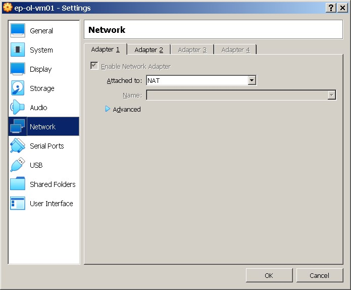

#  #####################
#       Task 2.1
# #######################
# PART 2. WORK WITH VIRTUALBOX
## 1. First run VirtualBox and Virtual Machine (VM). 
##   1.1 Get acquainted with the structure of the user manual VirtualBox [1] (see list of references in the end of the document) 
##   1.2 From the official VirtualBox site [2] download the latest stable version of VirtualBox according to the host operating system (OS) installed on the student's workplace. For    ## Windows, the file may be called, for example, VirtualBox-6.1.10-138449-Win.exe. Install VirtualBox. 

## 1.3 Download the latest stable version of Ubuntu Desktop or Ubuntu Server from the official site [3].  (Oracle Linux Server 7.9)
## 1.4 Create VM1 and install Ubuntu using the instructions [1, chapter 1.8]. Set machine name as "host machine name"_"student last name"

###  Create VM   ep-ol-vm01   and OS  Oracle Linux Server 7.9

### Create 2 net interfaces 
#### 1st  interfaces type NAT(default) – connect VM to Internet 

## 2nd interface Host-only Adapter  - to connect  Virtualbox Host  with  guest VM

Ping && ssh connect from Host to VM ep-ol-vm01(192.168.56.101)

## -- 1.5 Get acquainted with the possibilities of VM1 control - start, stop, reboot, save state, use Host key and keyboard shortcuts, mouse capture, etc. [1, ch.1.9] --
### Create snapshot of VM (https://www.virtualbox.org/manual/ch01.html#snapshots) name “ep-ol-vm01_snapsh_hostname_change_v1”

###  change VM’s hostname 

