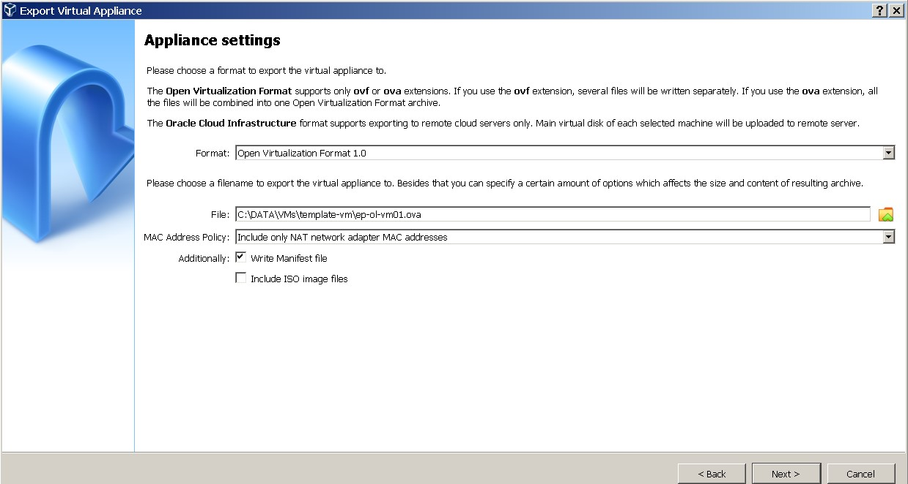
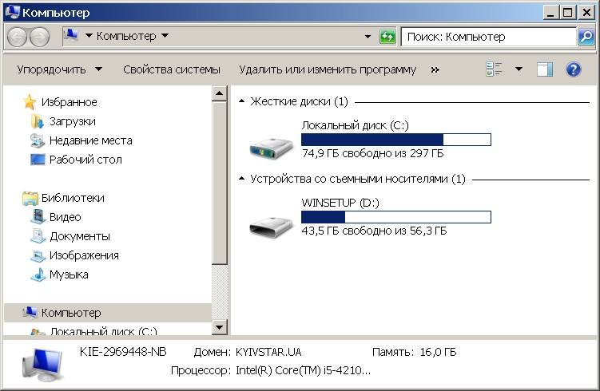

#  #####################
#       Task 2.1
# #######################
# PART 2. WORK WITH VIRTUALBOX
## 1. First run VirtualBox and Virtual Machine (VM). 
##   1.1 Get acquainted with the structure of the user manual VirtualBox [1] (see list of references in the end of the document) 
##   1.2 From the official VirtualBox site [2] download the latest stable version of VirtualBox according to the host operating system (OS) installed on the student's workplace. For    ## Windows, the file may be called, for example, VirtualBox-6.1.10-138449-Win.exe. Install VirtualBox. 

## 1.3 Download the latest stable version of Ubuntu Desktop or Ubuntu Server from the official site [3].  (Oracle Linux Server 7.9)
## 1.4 Create VM1 and install Ubuntu using the instructions [1, chapter 1.8]. Set machine name as "host machine name"_"student last name"

###  Create VM   ep-ol-vm01   and OS  Oracle Linux Server 7.9

### Create 2 net interfaces 
#### 1st  interfaces type NAT(default) – connect VM to Internet 

## 2nd interface Host-only Adapter  - to connect  Virtualbox Host  with  guest VM

Ping && ssh connect from Host to VM ep-ol-vm01(192.168.56.101)

## -- 1.5 Get acquainted with the possibilities of VM1 control - start, stop, reboot, save state, use Host key and keyboard shortcuts, mouse capture, etc. [1, ch.1.9] --
### Create snapshot of VM (https://www.virtualbox.org/manual/ch01.html#snapshots) name “ep-ol-vm01_snapsh_hostname_change_v1”

###  change VM’s hostname 

###  Restore VM from shapshot ep-ol-vm01_snapsh_hostname_change_v1

##  -- 1.6 Clone an existing VM1 by creating a VM2 [1, ch.1.14] --##
### Clone VM ep-ol-vm01   to  VM ep-ol-vm02

##  1.7 Create a group of two VM: VM1, VM2 and learn the functions related to groups [1, ch.1.10] --(https://www.virtualbox.org/manual/ch01.html#gui-vmgroups)
#### Crete group VM-Group-OL from VM ep-ol-vm01 and VM ep-ol-vm02

### Start VM from group VM-Group-OL

## -- 1.9 Export VM1. Save the .ova file to disk. Import VM from .ova file 

### --  Import VM from .ova file 

## USB to VM

---
**NOTE**
[root@ep-ol-vm01 vadim]# id
uid=0(root) gid=0(root) groups=0(root) context=unconfined_u:unconfined_r:unconfi                                                                                       ned_t:s0-s0:c0.c1023
[root@ep-ol-vm01 vadim]#
[root@ep-ol-vm01 vadim]#
[root@ep-ol-vm01 vadim]# lsscsi
[1:0:0:0]    cd/dvd  VBOX     CD-ROM           1.0   /dev/sr0
[2:0:0:0]    disk    ATA      VBOX HARDDISK    1.0   /dev/sda
[3:0:0:0]    disk    JetFlash Transcend 64GB   1100  /dev/sdb
[root@ep-ol-vm01 vadim]#

[root@ep-ol-vm01 yum.repos.d]# lsscsi
[1:0:0:0]    cd/dvd  VBOX     CD-ROM           1.0   /dev/sr0
[2:0:0:0]    disk    ATA      VBOX HARDDISK    1.0   /dev/sda
[3:0:0:0]    disk    JetFlash Transcend 64GB   1100  /dev/sdb
[root@ep-ol-vm01 yum.repos.d]#
[root@ep-ol-vm01 yum.repos.d]# fdisk -l /dev/sdb

Disk /dev/sdb: 60.5 GB, 60472426496 bytes, 118110208 sectors
Units = sectors of 1 * 512 = 512 bytes
Sector size (logical/physical): 512 bytes / 512 bytes
I/O size (minimum/optimal): 512 bytes / 512 bytes
Disk label type: dos
Disk identifier: 0x49f96372

   Device Boot      Start         End      Blocks   Id  System
/dev/sdb1   *       16128   118110207    59047040    7  HPFS/NTFS/exFAT
/dev/sdb4         5539936     6758471      609268    0  Empty
[root@ep-ol-vm01 yum.repos.d]#
]# yum-config-manager --enable oracle-epel-release-el7
[root@ep-ol-vm01 yum.repos.d]# yum install ntfs-3g 

[root@ep-ol-vm01 yum.repos.d]# mount  -t ntfs-3g /dev/sdb1 /mnt/usb01/
The disk contains an unclean file system (0, 0).
The file system wasn't safely closed on Windows. Fixing.
[root@ep-ol-vm01 yum.repos.d]# df -Th /mnt/usb01/
Filesystem     Type     Size  Used Avail Use% Mounted on
/dev/sdb1      fuseblk   57G   13G   44G  23% /mnt/usb01
[root@ep-ol-vm01 yum.repos.d]#
[root@ep-ol-vm01 yum.repos.d]# ls -l /mnt/usb01/
total 740
drwxrwxrwx. 1 root root   4096 Aug 28  2019 boot
-rwxrwxrwx. 1 root root 409654 Jul  9  2019 bootmgr
-rwxrwxrwx. 1 root root   2048 Jan 17  2012 default
drwxrwxrwx. 1 root root      0 Aug 28  2019 efi
-rwxrwxrwx. 1 root root 272255 Jul 24  2013 grldr
drwxrwxrwx. 1 root root      0 Aug 28  2019 ISO
-rwxrwxrwx. 1 root root   4252 Sep  3  2019 menu.lst
-rwxrwxrwx. 1 root root  43559 Feb 25  2012 plpbt.bin
-rwxrwxrwx. 1 root root   4365 Aug 22  2013 shifthd.bat
drwxrwxrwx. 1 root root      0 Sep  3  2019 soft
drwxrwxrwx. 1 root root      0 Aug 28  2019 System Volume Information
-rwxrwxrwx. 1 root root      0 Dec 12  2009 usbdrive.tag
drwxrwxrwx. 1 root root      0 Aug 28  2019 WINSETUP
[root@ep-ol-vm01 yum.repos.d]#

[root@ep-ol-vm01 yum.repos.d]# umount /mnt/usb01
[root@ep-ol-vm01 yum.repos.d]#
[root@ep-ol-vm01 yum.repos.d]# df -h
Filesystem           Size  Used Avail Use% Mounted on
devtmpfs             836M     0  836M   0% /dev
tmpfs                850M     0  850M   0% /dev/shm
tmpfs                850M  8.6M  841M   2% /run
tmpfs                850M     0  850M   0% /sys/fs/cgroup
/dev/mapper/ol-root  6.2G  2.2G  4.1G  35% /
/dev/sda1           1014M  192M  823M  19% /boot
tmpfs                170M     0  170M   0% /run/user/1000
[root@ep-ol-vm01 yum.repos.d]#

---

## 3. Work with CLI through VBoxManage. 

