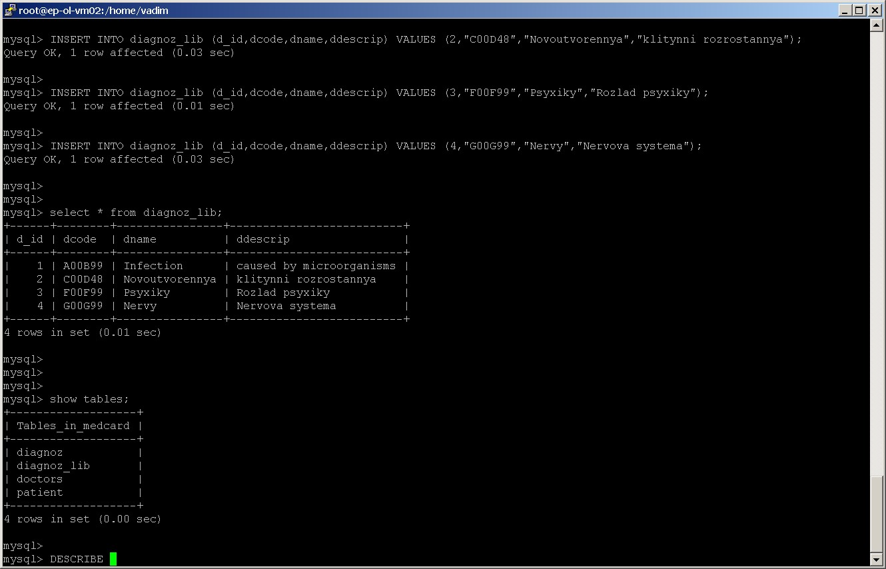
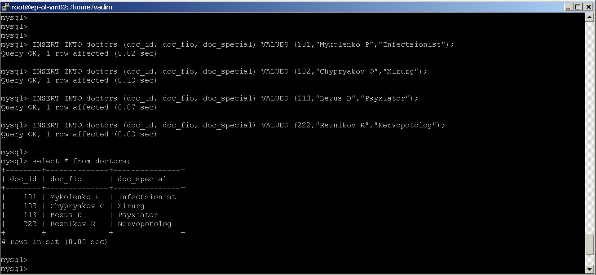
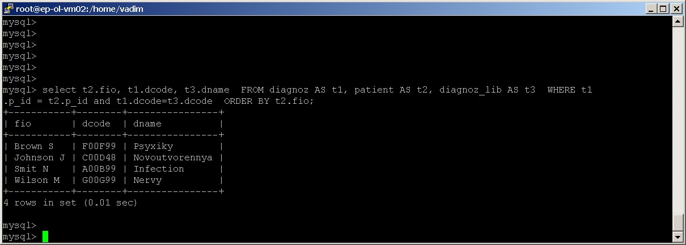
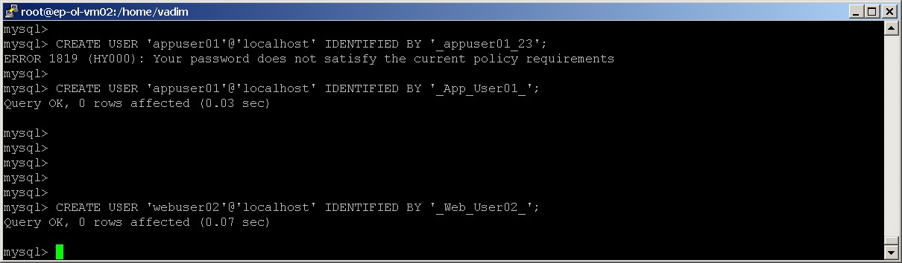
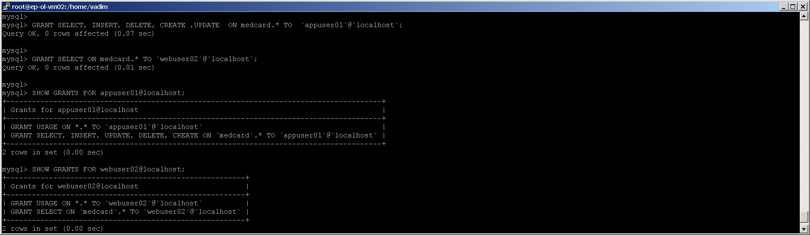

#  #########################
#  Module 7 Database Administration TASK 7.1
# ############################
## #--------------------------#
## ---  TASK 7.1 PART 1    ---
## #--------------------------#

### 1. Download MySQL server for your OS on VM.
#### get  OS version 
```
[root@ep-ol-vm02 vadim]# hostnamectl | egrep 'Operating System|Architecture|Kernel'
  Operating System: Oracle Linux Server 7.9
            Kernel: Linux 5.4.17-2102.201.3.el7uek.x86_64
      Architecture: x86-64
[root@ep-ol-vm02 vadim]#
```
#### - download  MySql –
Go to  Oracle Linux 7x repo  https://public-yum.oracle.com/oracle-linux-7.html
Select  MySql 8.0 for OS  OL7  Architecture: x86-64  

MySQL 8.0 Community Server: x86_64, Source(x86_64), aarch64, Source(aarch64)
Latest MySQL 8.0 Community Server packages for Oracle Linux 7.

Go to  https://public-yum.oracle.com/repo/OracleLinux/OL7/MySQL80_community/x86_64/index.html

#### Create repo file  /etc/yum.repos.d/OL7_x86_64_MySQL80.repo and check repository
```
[root@ep-ol-vm02 yum.repos.d]# cat   /etc/yum.repos.d/OL7_x86_64_MySQL80.repo
[OL7_x86-64_MySQL80]
name=MySQL 8.0 for Oracle Linux $releasever  ($basearch)
baseurl=http://yum.oracle.com/repo/OracleLinux/OL7/MySQL80_community/$basearch/
gpgkey=file:///etc/pki/rpm-gpg/RPM-GPG-KEY-oracle
gpgcheck=1
enabled=1

[root@ep-ol-vm02 yum.repos.d]#
[root@ep-ol-vm02 yum.repos.d]# yum repolist
Loaded plugins: langpacks, ulninfo
OL7_x86-64_MySQL80                                                                                           | 3.0 kB  00:00:00   <-!!!
ol7_UEKR6                                                                                                    | 3.0 kB  00:00:00
ol7_latest                                                                                                   | 3.6 kB  00:00:00
(1/2): OL7_x86-64_MySQL80/x86_64/updateinfo                                                                  |   71 B  00:00:00
(2/2): OL7_x86-64_MySQL80/x86_64/primary_db                                                                  | 204 kB  00:00:00
repo id                            repo name                                                                                  status
OL7_x86-64_MySQL80/x86_64          MySQL 8.0 for Oracle Linux 7Server  (x86_64)                                                  320
ol7_UEKR6/x86_64                   Latest Unbreakable Enterprise Kernel Release 6 for Oracle Linux 7Server (x86_64)              680
ol7_latest/x86_64                  Oracle Linux 7Server Latest (x86_64)                                                       24,340
repolist: 25,340
[root@ep-ol-vm02 yum.repos.d]#
```
### 2. Install MySQL server on VM.

##### check available mysql* packages from repositories
```
[root@ep-ol-vm02 yum.repos.d]#
[root@ep-ol-vm02 yum.repos.d]# yum list mysql-community*
Loaded plugins: langpacks, ulninfo
Available Packages
mysql-community-client.i686                                           8.0.29-1.el7                                OL7_x86-64_MySQL80
mysql-community-client.x86_64                                         8.0.29-1.el7                                OL7_x86-64_MySQL80
mysql-community-client-plugins.i686                                   8.0.29-1.el7                                OL7_x86-64_MySQL80
mysql-community-client-plugins.x86_64                                 8.0.29-1.el7                                OL7_x86-64_MySQL80
mysql-community-common.i686                                           8.0.29-1.el7                                OL7_x86-64_MySQL80
mysql-community-common.x86_64                                         8.0.29-1.el7                                OL7_x86-64_MySQL80
mysql-community-devel.i686                                            8.0.29-1.el7                                OL7_x86-64_MySQL80
mysql-community-devel.x86_64                                          8.0.29-1.el7                                OL7_x86-64_MySQL80
mysql-community-embedded-compat.i686                                  8.0.29-1.el7                                OL7_x86-64_MySQL80
mysql-community-embedded-compat.x86_64                                8.0.29-1.el7                                OL7_x86-64_MySQL80
mysql-community-icu-data-files.i686                                   8.0.29-1.el7                                OL7_x86-64_MySQL80
mysql-community-icu-data-files.x86_64                                 8.0.29-1.el7                                OL7_x86-64_MySQL80
mysql-community-libs.i686                                             8.0.29-1.el7                                OL7_x86-64_MySQL80
mysql-community-libs.x86_64                                           8.0.29-1.el7                                OL7_x86-64_MySQL80
mysql-community-libs-compat.i686                                      8.0.29-1.el7                                OL7_x86-64_MySQL80
mysql-community-libs-compat.x86_64                                    8.0.29-1.el7                                OL7_x86-64_MySQL80
mysql-community-server.x86_64                                         8.0.29-1.el7                                OL7_x86-64_MySQL80
mysql-community-server-debug.x86_64                                   8.0.29-1.el7                                OL7_x86-64_MySQL80
mysql-community-test.x86_64                                           8.0.29-1.el7                                OL7_x86-64_MySQL80
[root@ep-ol-vm02 yum.repos.d]#
```
####   Install mysql-community-server  with dependencies
```
[root@ep-ol-vm02 yum.repos.d]# yum install mysql-community-server
Loaded plugins: langpacks, ulninfo
Resolving Dependencies
--> Running transaction check
---> Package mysql-community-server.x86_64 0:8.0.29-1.el7 will be installed
--> Processing Dependency: mysql-community-common(x86-64) = 8.0.29-1.el7 for package: mysql-community-server-8.0.29-1.el7.x86_64
--> Processing Dependency: mysql-community-icu-data-files = 8.0.29-1.el7 for package: mysql-community-server-8.0.29-1.el7.x86_64
--> Processing Dependency: mysql-community-client(x86-64) >= 8.0.11 for package: mysql-community-server-8.0.29-1.el7.x86_64
--> Running transaction check
---> Package mysql-community-client.x86_64 0:8.0.29-1.el7 will be installed
--> Processing Dependency: mysql-community-client-plugins = 8.0.29-1.el7 for package: mysql-community-client-8.0.29-1.el7.x86_64
--> Processing Dependency: mysql-community-libs(x86-64) >= 8.0.11 for package: mysql-community-client-8.0.29-1.el7.x86_64
---> Package mysql-community-common.x86_64 0:8.0.29-1.el7 will be installed
---> Package mysql-community-icu-data-files.x86_64 0:8.0.29-1.el7 will be installed
--> Running transaction check
---> Package mariadb-libs.x86_64 1:5.5.68-1.el7 will be obsoleted
--> Processing Dependency: libmysqlclient.so.18()(64bit) for package: 2:postfix-2.10.1-9.el7.x86_64
--> Processing Dependency: libmysqlclient.so.18(libmysqlclient_18)(64bit) for package: 2:postfix-2.10.1-9.el7.x86_64
---> Package mysql-community-client-plugins.x86_64 0:8.0.29-1.el7 will be installed
---> Package mysql-community-libs.x86_64 0:8.0.29-1.el7 will be obsoleting
--> Running transaction check
---> Package mysql-community-libs-compat.x86_64 0:8.0.29-1.el7 will be obsoleting
--> Finished Dependency Resolution

Dependencies Resolved

====================================================================================================================================
 Package                                     Arch                Version                      Repository                       Size
====================================================================================================================================
Installing:
 mysql-community-libs                        x86_64              8.0.29-1.el7                 OL7_x86-64_MySQL80              1.5 M
     replacing  mariadb-libs.x86_64 1:5.5.68-1.el7
 mysql-community-libs-compat                 x86_64              8.0.29-1.el7                 OL7_x86-64_MySQL80              667 k
     replacing  mariadb-libs.x86_64 1:5.5.68-1.el7
 mysql-community-server                      x86_64              8.0.29-1.el7                 OL7_x86-64_MySQL80               53 M
Installing for dependencies:
 mysql-community-client                      x86_64              8.0.29-1.el7                 OL7_x86-64_MySQL80               14 M
 mysql-community-client-plugins              x86_64              8.0.29-1.el7                 OL7_x86-64_MySQL80              2.5 M
 mysql-community-common                      x86_64              8.0.29-1.el7                 OL7_x86-64_MySQL80              633 k
 mysql-community-icu-data-files              x86_64              8.0.29-1.el7                 OL7_x86-64_MySQL80              2.1 M

Transaction Summary
====================================================================================================================================
Install  3 Packages (+4 Dependent packages)

Total download size: 75 M
Is this ok [y/d/N]: y
Downloading packages:
warning: /var/cache/yum/x86_64/7Server/OL7_x86-64_MySQL80/packages/mysql-community-client-plugins-8.0.29-1.el7.x86_64.rpm: Header V3 RSA/SHA256 Signature, key ID ec551f03: NOKEY
Public key for mysql-community-client-plugins-8.0.29-1.el7.x86_64.rpm is not installed
(1/7): mysql-community-client-plugins-8.0.29-1.el7.x86_64.rpm                                                | 2.5 MB  00:00:08
(2/7): mysql-community-client-8.0.29-1.el7.x86_64.rpm                                                        |  14 MB  00:00:10
(3/7): mysql-community-common-8.0.29-1.el7.x86_64.rpm                                                        | 633 kB  00:00:02
(4/7): mysql-community-icu-data-files-8.0.29-1.el7.x86_64.rpm                                                | 2.1 MB  00:00:01
(5/7): mysql-community-libs-8.0.29-1.el7.x86_64.rpm                                                          | 1.5 MB  00:00:03
(6/7): mysql-community-libs-compat-8.0.29-1.el7.x86_64.rpm                                                   | 667 kB  00:00:01
(7/7): mysql-community-server-8.0.29-1.el7.x86_64.rpm                                                        |  53 MB  00:00:09
------------------------------------------------------------------------------------------------------------------------------------
Total                                                                                               3.1 MB/s |  75 MB  00:00:23
Retrieving key from file:///etc/pki/rpm-gpg/RPM-GPG-KEY-oracle
Importing GPG key 0xEC551F03:
 Userid     : "Oracle OSS group (Open Source Software group) <build@oss.oracle.com>"
 Fingerprint: 4214 4123 fecf c55b 9086 313d 72f9 7b74 ec55 1f03
 Package    : 7:oraclelinux-release-7.9-1.0.9.el7.x86_64 (@anaconda/7.9)
 From       : /etc/pki/rpm-gpg/RPM-GPG-KEY-oracle
Is this ok [y/N]: y
Running transaction check
Running transaction test
Transaction test succeeded
Running transaction
  Installing : mysql-community-common-8.0.29-1.el7.x86_64                                                                       1/8
  Installing : mysql-community-client-plugins-8.0.29-1.el7.x86_64                                                               2/8
  Installing : mysql-community-libs-8.0.29-1.el7.x86_64                                                                         3/8
  Installing : mysql-community-client-8.0.29-1.el7.x86_64                                                                       4/8
  Installing : mysql-community-icu-data-files-8.0.29-1.el7.x86_64                                                               5/8
  Installing : mysql-community-server-8.0.29-1.el7.x86_64                                                                       6/8
  Installing : mysql-community-libs-compat-8.0.29-1.el7.x86_64                                                                  7/8
  Erasing    : 1:mariadb-libs-5.5.68-1.el7.x86_64                                                                               8/8
  Verifying  : mysql-community-icu-data-files-8.0.29-1.el7.x86_64                                                               1/8
  Verifying  : mysql-community-libs-compat-8.0.29-1.el7.x86_64                                                                  2/8
  Verifying  : mysql-community-client-8.0.29-1.el7.x86_64                                                                       3/8
  Verifying  : mysql-community-client-plugins-8.0.29-1.el7.x86_64                                                               4/8
  Verifying  : mysql-community-server-8.0.29-1.el7.x86_64                                                                       5/8
  Verifying  : mysql-community-common-8.0.29-1.el7.x86_64                                                                       6/8
  Verifying  : mysql-community-libs-8.0.29-1.el7.x86_64                                                                         7/8
  Verifying  : 1:mariadb-libs-5.5.68-1.el7.x86_64                                                                               8/8

Installed:
  mysql-community-libs.x86_64 0:8.0.29-1.el7                     mysql-community-libs-compat.x86_64 0:8.0.29-1.el7
  mysql-community-server.x86_64 0:8.0.29-1.el7

Dependency Installed:
  mysql-community-client.x86_64 0:8.0.29-1.el7                 mysql-community-client-plugins.x86_64 0:8.0.29-1.el7
  mysql-community-common.x86_64 0:8.0.29-1.el7                 mysql-community-icu-data-files.x86_64 0:8.0.29-1.el7

Replaced:
  mariadb-libs.x86_64 1:5.5.68-1.el7

Complete!
[root@ep-ol-vm02 yum.repos.d]#
```

#### ---check installed MySQL packages 
```
[root@ep-ol-vm02 yum.repos.d]# yum list installed mysql*
Loaded plugins: langpacks, ulninfo
Installed Packages
mysql-community-client.x86_64                                        8.0.29-1.el7                                @OL7_x86-64_MySQL80
mysql-community-client-plugins.x86_64                                8.0.29-1.el7                                @OL7_x86-64_MySQL80
mysql-community-common.x86_64                                        8.0.29-1.el7                                @OL7_x86-64_MySQL80
mysql-community-icu-data-files.x86_64                                8.0.29-1.el7                                @OL7_x86-64_MySQL80
mysql-community-libs.x86_64                                          8.0.29-1.el7                                @OL7_x86-64_MySQL80
mysql-community-libs-compat.x86_64                                   8.0.29-1.el7                                @OL7_x86-64_MySQL80
mysql-community-server.x86_64                                        8.0.29-1.el7                                @OL7_x86-64_MySQL80
[root@ep-ol-vm02 yum.repos.d]#
```

#### ---   Start the mysqld service
```
[root@ep-ol-vm02 yum.repos.d]# systemctl start mysqld
[root@ep-ol-vm02 yum.repos.d]#
[root@ep-ol-vm02 yum.repos.d]# systemctl status  mysqld
- mysqld.service - MySQL Server
   Loaded: loaded (/usr/lib/systemd/system/mysqld.service; enabled; vendor preset: disabled)
   Active: active (running) since Sun 2022-05-22 15:25:51 EEST; 9s ago                       <- !!!
     Docs: man:mysqld(8)
           http://dev.mysql.com/doc/refman/en/using-systemd.html
  Process: 4286 ExecStartPre=/usr/bin/mysqld_pre_systemd (code=exited, status=0/SUCCESS)
 Main PID: 4357 (mysqld)
   Status: "Server is operational"
   CGroup: /system.slice/mysqld.service
           └─4357 /usr/sbin/mysqld

May 22 15:25:39 ep-ol-vm02 systemd[1]: Starting MySQL Server...
May 22 15:25:51 ep-ol-vm02 systemd[1]: Started MySQL Server.
[root@ep-ol-vm02 yum.repos.d]#
````
####  ---  run  /usr/bin/mysql_secure_installation   scripts
```
[root@ep-ol-vm02 yum.repos.d]# /usr/bin/mysql_secure_installation

Securing the MySQL server deployment.

Enter password for user root:
Error: Access denied for user 'root'@'localhost' (using password: YES)
````

#### --- Get temporary mysql root user password 
#### A superuser account 'root'@'localhost is created. A password for the superuser is set and stored in the error log file. To reveal it, use the following command:
#### $> sudo grep 'temporary password' /var/log/mysqld.log
 ````
[root@ep-ol-vm02 yum.repos.d]# sudo grep 'temporary password' /var/log/mysqld.log
2022-05-22T12:25:44.091857Z 6 [Note] [MY-010454] [Server] A temporary password is generated for root@localhost: TUtBrMpk6g;i
[root@ep-ol-vm02 yum.repos.d]#

[root@ep-ol-vm02 yum.repos.d]# mysql -u root -p
Enter password:
Welcome to the MySQL monitor.  Commands end with ; or \g.
Your MySQL connection id is 13
Server version: 8.0.29

Copyright (c) 2000, 2022, Oracle and/or its affiliates.

Oracle is a registered trademark of Oracle Corporation and/or its
affiliates. Other names may be trademarks of their respective
owners.

Type 'help;' or '\h' for help. Type '\c' to clear the current input statement.

mysql>
````
#### --  Change  root password 
````
mysql>
mysql> ALTER USER 'root'@'localhost' IDENTIFIED BY 'NewPassword_for_root_user!';
Query OK, 0 rows affected (0.04 sec)

mysql>
mysql> exit
Bye
[root@ep-ol-vm02 yum.repos.d]#
````
---- 
### 3. Select a subject area and describe the database schema, (minimum 3 tables)

#### Subject area (DATABASE name): Medical card [medcard]

````
------------------------
|Table#01:Patient      |
------------------------
|p_id           | number|
| fio           | string|
| insuarence_num| number|
-------------------------

----------------------------
|Table#02:Diagnoz-Lib|
---------------- -----------
|d-code          |  number |
|dname           | String |
|ddiscription     | string|
----------------------------

-------------------------
|Table#03: Diagnoz|
-------------------------
|dnum       | number |
|p_id       | number |
|d-code     | number |
|d_date    | datetime|
|doc_id     | number |
------------------ -------

----------+--------------
|Table#04: Doctor |
------------+-----------
|doc_id      | number |
|doc_fio     |  string|
|doc_special | string |
-------------------------

````

### 4. Create a database on the server through the console.
#### -- create database medcard
````
mysql> show databases;
+--------------------+
| Database           |
+--------------------+
| information_schema |
| mysql              |
| performance_schema |
| sys                |
+--------------------+
4 rows in set (0.00 sec)

mysql>
mysql> CREATE DATABASE medcard;      <- !!!
Query OK, 1 row affected (0.16 sec)

mysql> show databases;
+--------------------+
| Database           |
+--------------------+
| information_schema |
| medcard            |     <- !!!
| mybooks            |
| mysql              |
| performance_schema |
| sys                |
+--------------------+
6 rows in set (0.00 sec)

mysql>
mysql> use medcard;      <- !!!
Database changed
mysql>

mysql> select database();
+------------+
| database() |
+------------+
| medcard    |
+------------+
1 row in set (0.00 sec)
````

#### -- Create 4 tables  patient, diagnoz_lib, diagnoz, doctors
````
mysql> CREATE TABLE patient (p_id INT NOT NULL, fio VARCHAR(50) NOT NULL, insuarence_num INT, PRIMARY KEY (p_id) );
Query OK, 0 rows affected (0.07 sec)

mysql> show tables ;
+-------------------+
| Tables_in_medcard |
+-------------------+
| patient           |
+-------------------+
1 row in set (0.00 sec)

mysql>
mysql> CREATE TABLE diagnoz_lib (dcode INT NOT NULL, dname VARCHAR(50) NOT NULL, ddescrip VARCHAR(250) NOT NULL, PRIMARY KEY (dcode)
 );
Query OK, 0 rows affected (0.13 sec)
mysql>

 mysql> show tables;
+-------------------+
| Tables_in_medcard |
+-------------------+
| diagnoz_lib       |
| patient           |
+-------------------+
2 rows in set (0.00 sec)

mysql>
mysql> CREATE TABLE diagnoz (dnum INT NOT NULL, p_id INT NOT NULL, dcode INT NOT NULL, ddate DATETIME NOT NULL, doc_id INT NOT NULL );
Query OK, 0 rows affected (0.06 sec)

mysql>
mysql> CREATE TABLE doctors (doc_id INT NOT NULL, doc_fio VARCHAR(50) NOT NULL, doc_special VARCHAR(50) NOT NULL );
Query OK, 0 rows affected (0.10 sec)

mysql>
mysql> show tables;
+-------------------+
| Tables_in_medcard |
+-------------------+
| diagnoz           |
| diagnoz_lib       |
| doctors           |
| patient           |
+-------------------+
4 rows in set (0.01 sec)

mysql>
````
----
### 5. Fill in tables
## --- Fill  tables of “medcard” database

````
mysql> use medcard;
Reading table information for completion of table and column names
You can turn off this feature to get a quicker startup with -A

Database changed
mysql>
mysql> select database();
+------------+
| database() |
+------------+
| medcard    |
+------------+
1 row in set (0.01 sec)

mysql>
mysql> show tables;
+-------------------+
| Tables_in_medcard |
+-------------------+
| diagnoz           |
| diagnoz_lib       |
| doctors           |
| patient           |
+-------------------+
4 rows in set (0.00 sec)

mysql>
````
#### fill table patient 
````
mysql> DESCRIBE patient;
+----------------+-------------+------+-----+---------+-------+
| Field          | Type        | Null | Key | Default | Extra |
+----------------+-------------+------+-----+---------+-------+
| p_id           | int         | NO   | PRI | NULL    |       |
| fio            | varchar(50) | NO   |     | NULL    |       |
| insuarence_num | int         | YES  |     | NULL    |       |
+----------------+-------------+------+-----+---------+-------+
3 rows in set (0.01 sec)

mysql>
mysql> INSERT INTO patient (p_id,fio,insuarence_num) VALUES (100101,"Smit N",90100101);
Query OK, 1 row affected (0.25 sec)

mysql> INSERT INTO patient (p_id,fio,insuarence_num) VALUES (100102,"Brown S",90100102);
Query OK, 1 row affected (0.03 sec)

mysql> INSERT INTO patient (p_id,fio,insuarence_num) VALUES (100201,"Wilson M",90100201);
Query OK, 1 row affected (0.05 sec)

mysql> INSERT INTO patient (p_id,fio,insuarence_num) VALUES (100209,"Johnson J",90100209);
Query OK, 1 row affected (0.03 sec)

mysql>
mysql> select * from patient;
+--------+-----------+----------------+
| p_id   | fio       | insuarence_num |
+--------+-----------+----------------+
| 100101 | Smit N    |       90100101 |
| 100102 | Brown S   |       90100102 |
| 100201 | Wilson M  |       90100201 |
| 100209 | Johnson J |       90100209 |
+--------+-----------+----------------+
4 rows in set (0.00 sec)

mysql>
````


#### ---- modify table structure 
````
mysql> DESCRIBE diagnoz_lib;
+----------+--------------+------+-----+---------+-------+
| Field    | Type         | Null | Key | Default | Extra |
+----------+--------------+------+-----+---------+-------+
| dcode    | int          | NO   | PRI | NULL    |       |
| dname    | varchar(50)  | NO   |     | NULL    |       |
| ddescrip | varchar(250) | NO   |     | NULL    |       |
+----------+--------------+------+-----+---------+-------+
3 rows in set (0.00 sec)

mysql> ALTER TABLE diagnoz_lib MODIFY dcode VARCHAR(6);
Query OK, 0 rows affected (0.21 sec)
Records: 0  Duplicates: 0  Warnings: 0

mysql>
mysql> DESCRIBE diagnoz_lib;
+----------+--------------+------+-----+---------+-------+
| Field    | Type         | Null | Key | Default | Extra |
+----------+--------------+------+-----+---------+-------+
| dcode    | varchar(6)   | NO   | PRI | NULL    |       |
| dname    | varchar(50)  | NO   |     | NULL    |       |
| ddescrip | varchar(250) | NO   |     | NULL    |       |
+----------+--------------+------+-----+---------+-------+
3 rows in set (0.00 sec)

mysql>
mysql> ALTER TABLE diagnoz_lib ADD COLUMN  d_id INT NOT NULL FIRST;
Query OK, 0 rows affected (0.04 sec)
Records: 0  Duplicates: 0  Warnings: 0

mysql>
mysql> DESCRIBE diagnoz_lib;
+----------+--------------+------+-----+---------+-------+
| Field    | Type         | Null | Key | Default | Extra |
+----------+--------------+------+-----+---------+-------+
| d_id     | int          | NO   |     | NULL    |       |
| dcode    | varchar(6)   | NO   | PRI | NULL    |       |
| dname    | varchar(50)  | NO   |     | NULL    |       |
| ddescrip | varchar(250) | NO   |     | NULL    |       |
+----------+--------------+------+-----+---------+-------+
4 rows in set (0.00 sec)

mysql>
````

####  --  Fill table diagnoz_lib 
````
mysql> DESCRIBE diagnoz_lib;
+----------+--------------+------+-----+---------+-------+
| Field    | Type         | Null | Key | Default | Extra |
+----------+--------------+------+-----+---------+-------+
| d_id     | int          | NO   |     | NULL    |       |
| dcode    | varchar(6)   | NO   | PRI | NULL    |       |
| dname    | varchar(50)  | NO   |     | NULL    |       |
| ddescrip | varchar(250) | NO   |     | NULL    |       |
+----------+--------------+------+-----+---------+-------+
4 rows in set (0.00 sec)

mysql>
mysql> INSERT INTO diagnoz_lib (d_id,dcode,dname,ddescrip) VALUES (1,"A00B99","Infection","caused by microorganisms")
    -> ;
Query OK, 1 row affected (0.07 sec)

mysql> INSERT INTO diagnoz_lib (d_id,dcode,dname,ddescrip) VALUES (2,"C00D48","Novoutvorennya","klitynni rozrostannya");
Query OK, 1 row affected (0.03 sec)

mysql>
mysql> INSERT INTO diagnoz_lib (d_id,dcode,dname,ddescrip) VALUES (3,"F00F99","Psyxiky","Rozlad psyxiky");
Query OK, 1 row affected (0.01 sec)

mysql>
mysql> INSERT INTO diagnoz_lib (d_id,dcode,dname,ddescrip) VALUES (4,"G00G99","Nervy","Nervova systema");
Query OK, 1 row affected (0.03 sec)

mysql>
mysql> select * from diagnoz_lib;
+------+--------+----------------+--------------------------+
| d_id | dcode  | dname          | ddescrip                 |
+------+--------+----------------+--------------------------+
|    1 | A00B99 | Infection      | caused by microorganisms |
|    2 | C00D48 | Novoutvorennya | klitynni rozrostannya    |
|    3 | F00F99 | Psyxiky        | Rozlad psyxiky           |
|    4 | G00G99 | Nervy          | Nervova systema          |
+------+--------+----------------+--------------------------+
4 rows in set (0.01 sec)

mysql>
````



#### -- Fill doctors table --
```
mysql> DESCRIBE doctors;
+-------------+-------------+------+-----+---------+-------+
| Field       | Type        | Null | Key | Default | Extra |
+-------------+-------------+------+-----+---------+-------+
| doc_id      | int         | NO   |     | NULL    |       |
| doc_fio     | varchar(50) | NO   |     | NULL    |       |
| doc_special | varchar(50) | NO   |     | NULL    |       |
+-------------+-------------+------+-----+---------+-------+
3 rows in set (0.00 sec)

mysql>


mysql> DESCRIBE doctors;
+-------------+-------------+------+-----+---------+-------+
| Field       | Type        | Null | Key | Default | Extra |
+-------------+-------------+------+-----+---------+-------+
| doc_id      | int         | NO   |     | NULL    |       |
| doc_fio     | varchar(50) | NO   |     | NULL    |       |
| doc_special | varchar(50) | NO   |     | NULL    |       |
+-------------+-------------+------+-----+---------+-------+
3 rows in set (0.00 sec)

mysql>

mysql> INSERT INTO doctors (doc_id, doc_fio, doc_special) VALUES (101,"Mykolenko P","Infectsionist");
Query OK, 1 row affected (0.02 sec)

mysql> INSERT INTO doctors (doc_id, doc_fio, doc_special) VALUES (102,"Chypryakov O","Xirurg");
Query OK, 1 row affected (0.13 sec)

mysql> INSERT INTO doctors (doc_id, doc_fio, doc_special) VALUES (113,"Bezus D","Psyxiator");
Query OK, 1 row affected (0.07 sec)

mysql> INSERT INTO doctors (doc_id, doc_fio, doc_special) VALUES (222,"Reznikov R","Nervopotolog");
Query OK, 1 row affected (0.03 sec)

mysql>
mysql> select * from doctors;
+--------+--------------+---------------+
| doc_id | doc_fio      | doc_special   |
+--------+--------------+---------------+
|    101 | Mykolenko P  | Infectsionist |
|    102 | Chypryakov O | Xirurg        |
|    113 | Bezus D      | Psyxiator     |
|    222 | Reznikov R   | Nervopotolog  |
+--------+--------------+---------------+
4 rows in set (0.00 sec)

mysql>
```


#### -- Fill diagnoz table --
```
mysql> DESCRIBE diagnoz;
+--------+------------+------+-----+---------+-------+
| Field  | Type       | Null | Key | Default | Extra |
+--------+------------+------+-----+---------+-------+
| dnum   | int        | NO   |     | NULL    |       |
| p_id   | int        | NO   |     | NULL    |       |
| dcode  | varchar(6) | NO   |     | NULL    |       |
| ddate  | datetime   | NO   |     | NULL    |       |
| doc_id | int        | NO   |     | NULL    |       |
+--------+------------+------+-----+---------+-------+
5 rows in set (0.00 sec)

mysql>
mysql> INSERT INTO diagnoz (dnum,p_id,dcode,ddate,doc_id) VALUES (1,100101,"A00B99",'2012-12-12 17:17:17',101);
Query OK, 1 row affected (0.01 sec)

mysql> INSERT INTO diagnoz (dnum,p_id,dcode,ddate,doc_id) VALUES (2,100102,"F00F99",'2021-12-21 21:21:21',113);
Query OK, 1 row affected (0.01 sec)

mysql>
mysql> INSERT INTO diagnoz (dnum,p_id,dcode,ddate,doc_id) VALUES (21,100201,"G00G99",'2020-10-20 20:20:20',222);
Query OK, 1 row affected (0.01 sec)

mysql>
mysql> INSERT INTO diagnoz (dnum,p_id,dcode,ddate,doc_id) VALUES (29,100209,"C00D48",'2021-01-01 01:01:01',102);
Query OK, 1 row affected (0.01 sec)

mysql>
mysql> select * from diagnoz;
+------+--------+--------+---------------------+--------+
| dnum | p_id   | dcode  | ddate               | doc_id |
+------+--------+--------+---------------------+--------+
|    1 | 100101 | A00B99 | 2012-12-12 17:17:17 |    101 |
|    2 | 100102 | F00F99 | 2021-12-21 21:21:21 |    113 |
|   21 | 100201 | G00G99 | 2020-10-20 20:20:20 |    222 |
|   29 | 100209 | C00D48 | 2021-01-01 01:01:01 |    102 |
+------+--------+--------+---------------------+--------+
4 rows in set (0.00 sec)

mysql>
```

### -- 6. Construct and execute SELECT operator with WHERE, GROUP BY and ORDER BY
#### - show tables structure
```
mysql> use medcard;
Reading table information for completion of table and column names
You can turn off this feature to get a quicker startup with -A

Database changed
mysql>
mysql> select  database();
+------------+
| database() |
+------------+
| medcard    |
+------------+
1 row in set (0.00 sec)

mysql>
mysql> show tables;
+-------------------+
| Tables_in_medcard |
+-------------------+
| diagnoz           |
| diagnoz_lib       |
| doctors           |
| patient           |
+-------------------+
4 rows in set (0.01 sec)

mysql>
mysql> DESCRIBE diagnoz;
+--------+------------+------+-----+---------+-------+
| Field  | Type       | Null | Key | Default | Extra |
+--------+------------+------+-----+---------+-------+
| dnum   | int        | NO   |     | NULL    |       |
| p_id   | int        | NO   |     | NULL    |       |
| dcode  | varchar(6) | NO   |     | NULL    |       |
| ddate  | datetime   | NO   |     | NULL    |       |
| doc_id | int        | NO   |     | NULL    |       |
+--------+------------+------+-----+---------+-------+
5 rows in set (0.01 sec)

mysql>
mysql> DESCRIBE diagnoz_lib;
+----------+--------------+------+-----+---------+-------+
| Field    | Type         | Null | Key | Default | Extra |
+----------+--------------+------+-----+---------+-------+
| d_id     | int          | NO   |     | NULL    |       |
| dcode    | varchar(6)   | NO   | PRI | NULL    |       |
| dname    | varchar(50)  | NO   |     | NULL    |       |
| ddescrip | varchar(250) | NO   |     | NULL    |       |
+----------+--------------+------+-----+---------+-------+
4 rows in set (0.01 sec)

mysql> DESCRIBE doctors;
+-------------+-------------+------+-----+---------+-------+
| Field       | Type        | Null | Key | Default | Extra |
+-------------+-------------+------+-----+---------+-------+
| doc_id      | int         | NO   |     | NULL    |       |
| doc_fio     | varchar(50) | NO   |     | NULL    |       |
| doc_special | varchar(50) | NO   |     | NULL    |       |
+-------------+-------------+------+-----+---------+-------+
3 rows in set (0.01 sec)

mysql>
mysql> DESCRIBE patient;
+----------------+-------------+------+-----+---------+-------+
| Field          | Type        | Null | Key | Default | Extra |
+----------------+-------------+------+-----+---------+-------+
| p_id           | int         | NO   | PRI | NULL    |       |
| fio            | varchar(50) | NO   |     | NULL    |       |
| insuarence_num | int         | YES  |     | NULL    |       |
+----------------+-------------+------+-----+---------+-------+
3 rows in set (0.00 sec)

mysql>
```

#### - select from 2 tables:  select t2.fio, t1.dcode   FROM diagnoz AS t1, patient AS t2  WHERE t1.p_id = t2.p_id;
```
mysql> select t2.fio, t1.dcode   FROM diagnoz AS t1, patient AS t2  WHERE t1.p_id = t2.p_id;
+-----------+--------+
| fio       | dcode  |
+-----------+--------+
| Smit N    | A00B99 |
| Brown S   | F00F99 |
| Wilson M  | G00G99 |
| Johnson J | C00D48 |
+-----------+--------+
4 rows in set (0.09 sec)
```
#### - select from 3 tables:  "select t2.fio, t1.dcode, t3.dname  FROM diagnoz AS t1, patient AS t2, diagnoz_lib AS t3  WHERE t1.p_id = t2.p_id and t1.dcode=t3.dcode  ORDER BY t2.fio;"
```
mysql> select t2.fio, t1.dcode, t3.dname  FROM diagnoz AS t1, patient AS t2, diagnoz_lib AS t3  WHERE t1.p_id = t2.p_id and t1.dcode=t3.dcode  ORDER BY t2.fio;
+-----------+--------+----------------+
| fio       | dcode  | dname          |
+-----------+--------+----------------+
| Brown S   | F00F99 | Psyxiky        |
| Johnson J | C00D48 | Novoutvorennya |
| Smit N    | A00B99 | Infection      |
| Wilson M  | G00G99 | Nervy          |
+-----------+--------+----------------+
4 rows in set (0.01 sec)

mysql>

```



### -- Create a database of new users with different privileges. Connect to the database as a new user and verify that the privileges allow or deny certain actions.
#### ---- Create  TWO users appuser01 (app admin ) and  webuser02 (app user for full access to  tables, webuser02 for read only data drom tables)
```
mysql> CREATE USER 'appuser01'@'localhost' IDENTIFIED BY '_App_User01_';
Query OK, 0 rows affected (0.03 sec)

mysql>
mysql> CREATE USER 'webuser02'@'localhost' IDENTIFIED BY '_Web_User02_';
Query OK, 0 rows affected (0.07 sec)

mysql>
```


#### -Add garnts for appuser01   for management tables in MEDCARD database
```
mysql> SHOW GRANTS FOR appuser01@localhost;
+-----------------------------------------------+
| Grants for appuser01@localhost                |
+-----------------------------------------------+
| GRANT USAGE ON *.* TO `appuser01`@`localhost` |
+-----------------------------------------------+
1 row in set (0.00 sec)

mysql> GRANT SELECT, INSERT, DELETE, CREATE ,UPDATE  ON medcard.* TO  `appuser01`@`localhost`;
Query OK, 0 rows affected (0.07 sec)

mysql>
mysql> SHOW GRANTS FOR appuser01@localhost;
+----------------------------------------------------------------------------------------+
| Grants for appuser01@localhost                                                         |
+----------------------------------------------------------------------------------------+
| GRANT USAGE ON *.* TO `appuser01`@`localhost`                                          |
| GRANT SELECT, INSERT, UPDATE, DELETE, CREATE ON `medcard`.* TO `appuser01`@`localhost` |
+----------------------------------------------------------------------------------------+
2 rows in set (0.00 sec)

mysql>
```
#### -- Add garnts for webuser02  ONLY for read date from  tables in MEDCARD database
````
mysql> SHOW GRANTS FOR webuser02@localhost;
+-----------------------------------------------+
| Grants for webuser02@localhost                |
+-----------------------------------------------+
| GRANT USAGE ON *.* TO `webuser02`@`localhost` |
+-----------------------------------------------+
1 row in set (0.00 sec)

mysql>
mysql> GRANT SELECT ON medcard.* TO `webuser02`@`localhost`;
Query OK, 0 rows affected (0.01 sec)

mysql>
mysql> SHOW GRANTS FOR webuser02@localhost;
+--------------------------------------------------------+
| Grants for webuser02@localhost                         |
+--------------------------------------------------------+
| GRANT USAGE ON *.* TO `webuser02`@`localhost`          |
| GRANT SELECT ON `medcard`.* TO `webuser02`@`localhost` |
+--------------------------------------------------------+
2 rows in set (0.00 sec)

mysql>
````


#### -- Log as appuser01 and management  table 
````
[vadim@ep-ol-vm02 ~]$ mysql -u appuser01 -p
Enter password:
Welcome to the MySQL monitor.  Commands end with ; or \g.
Your MySQL connection id is 9
Server version: 8.0.29 MySQL Community Server - GPL

Copyright (c) 2000, 2022, Oracle and/or its affiliates.

Oracle is a registered trademark of Oracle Corporation and/or its
affiliates. Other names may be trademarks of their respective
owners.

Type 'help;' or '\h' for help. Type '\c' to clear the current input statement.

mysql> use medcard;
Reading table information for completion of table and column names
You can turn off this feature to get a quicker startup with -A

Database changed
mysql>
mysql> show tables;
+-------------------+
| Tables_in_medcard |
+-------------------+
| diagnoz           |
| diagnoz_lib       |
| doctors           |
| patient           |
+-------------------+
4 rows in set (0.00 sec)

mysql>  INSERT INTO diagnoz (dnum,p_id,dcode,ddate,doc_id) VALUES (1,100101,"C00D48",'2009-09-09 14:14:14',102);
Query OK, 1 row affected (0.03 sec)

mysql> select * from diagnoz WHERE dcode = "C00D48"
    -> ;
+------+--------+--------+---------------------+--------+
| dnum | p_id   | dcode  | ddate               | doc_id |
+------+--------+--------+---------------------+--------+
|   29 | 100209 | C00D48 | 2021-01-01 01:01:01 |    102 |
|    1 | 100101 | C00D48 | 2009-09-09 14:14:14 |    102 |
+------+--------+--------+---------------------+--------+
2 rows in set (0.00 sec)

mysql>
````

#### ---log as webuser02  and try to INSERT into table 
````
[vadim@ep-ol-vm02 ~]$ mysql -u webuser02 -p
Enter password:
Welcome to the MySQL monitor.  Commands end with ; or \g.
Your MySQL connection id is 12
Server version: 8.0.29 MySQL Community Server - GPL

Copyright (c) 2000, 2022, Oracle and/or its affiliates.

Oracle is a registered trademark of Oracle Corporation and/or its
affiliates. Other names may be trademarks of their respective
owners.

Type 'help;' or '\h' for help. Type '\c' to clear the current input statement.

mysql> SELECT USER();
+---------------------+
| USER()              |
+---------------------+
| webuser02@localhost |
+---------------------+
1 row in set (0.00 sec)

mysql>

mysql> use medcard;
Reading table information for completion of table and column names
You can turn off this feature to get a quicker startup with -A

Database changed
mysql>
mysql> select database();
+------------+
| database() |
+------------+
| medcard    |
+------------+
1 row in set (0.00 sec)

````
#### --try to INSERT, but we can’t do this because user webuser02 don’t have INSERT grant
````
mysql> INSERT INTO diagnoz (dnum,p_id,dcode,ddate,doc_id) VALUES (6,100201,"G00G99",'2010-10-10 10:10:10',222);
ERROR 1142 (42000): INSERT command denied to user 'webuser02'@'localhost' for table 'diagnoz'                     <-!!!
mysql>
````
#### -- But  only select data from tables it possible for user webuser02
````
mysql> select * from diagnoz WHERE dcode = "C00D48";
+------+--------+--------+---------------------+--------+
| dnum | p_id   | dcode  | ddate               | doc_id |
+------+--------+--------+---------------------+--------+
|   29 | 100209 | C00D48 | 2021-01-01 01:01:01 |    102 |
|    1 | 100101 | C00D48 | 2009-09-09 14:14:14 |    102 |
+------+--------+--------+---------------------+--------+
2 rows in set (0.00 sec)

mysql>
````

----
## #--------------------------#
## ---  TASK 7.1 PART 2    ---
## #--------------------------#
----
#### 10.Make backup of your database
##### -- Create backup  MEDCARD database use mysqldump in file /export/mysqldata/mysqlbackup/medcard_bkp.data
````
[root@ep-ol-vm02 vadim]# mkdir -p /export/mysqldata/mysqlbackup
[root@ep-ol-vm02 vadim]#
[root@ep-ol-vm02 vadim]# mysqldump -u root -p medcard > /export/mysqldata/mysqlbackup/medcard_bkp.data    <-!!!
Enter password:
[root@ep-ol-vm02 vadim]#
[root@ep-ol-vm02 vadim]# ls -l /export/mysqldata/mysqlbackup/medcard_bkp.data
-rw-r--r--. 1 root root 4639 May 29 20:13 /export/mysqldata/mysqlbackup/medcard_bkp.data
[root@ep-ol-vm02 vadim]#
````

#### 11.Delete the table and/or part of the data in the table.
#### --- Delete row from table  “doctors”  where doc_fio="Reznikov R"
````
mysql> select * FROM doctors;
+--------+--------------+---------------+
| doc_id | doc_fio      | doc_special   |
+--------+--------------+---------------+
|    101 | Mykolenko P  | Infectsionist |
|    102 | Chypryakov O | Xirurg        |
|    113 | Bezus D      | Psyxiator     |
|    222 | Reznikov R   | Nervopotolog  |     <-!!!
+--------+--------------+---------------+
4 rows in set (0.00 sec)

mysql>
mysql> DELETE FROM doctors WHERE doc_fio="Reznikov R";
Query OK, 1 row affected (0.01 sec)

mysql> select * FROM doctors;
+--------+--------------+---------------+
| doc_id | doc_fio      | doc_special   |
+--------+--------------+---------------+
|    101 | Mykolenko P  | Infectsionist |
|    102 | Chypryakov O | Xirurg        |
|    113 | Bezus D      | Psyxiator     |
+--------+--------------+---------------+
3 rows in set (0.00 sec)

mysql>
````
----
### 12.Restore your database.

#### ---- Rectore  database medcard  from file /export/mysqldata/mysqlbackup/medcard_bkp.data and check tables “patient” && “doctors”
````
[root@ep-ol-vm02 vadim]# mysql -u root -p  medcard  <  /export/mysqldata/mysqlbackup/medcard_bkp.data
Enter password:
[root@ep-ol-vm02 vadim]#

[root@ep-ol-vm02 vadim]# mysql -u root -p
Enter password:
Welcome to the MySQL monitor.  Commands end with ; or \g.
Your MySQL connection id is 17
Server version: 8.0.29 MySQL Community Server - GPL

Copyright (c) 2000, 2022, Oracle and/or its affiliates.

Oracle is a registered trademark of Oracle Corporation and/or its
affiliates. Other names may be trademarks of their respective
owners.

Type 'help;' or '\h' for help. Type '\c' to clear the current input statement.

mysql>
````
````
mysql> use medcard;
Reading table information for completion of table and column names
You can turn off this feature to get a quicker startup with -A

Database changed
mysql>
mysql> select * from patient;
+--------+-----------+----------------+
| p_id   | fio       | insuarence_num |
+--------+-----------+----------------+
| 100101 | Smit N    |       90100101 |
| 100102 | Brown S   |       90100102 |
| 100201 | Wilson M  |       90100201 |
| 100209 | Johnson J |       90100209 |
+--------+-----------+----------------+
4 rows in set (0.01 sec)

mysql>
mysql> select * from doctors;
+--------+--------------+---------------+
| doc_id | doc_fio      | doc_special   |
+--------+--------------+---------------+
|    101 | Mykolenko P  | Infectsionist |
|    102 | Chypryakov O | Xirurg        |
|    113 | Bezus D      | Psyxiator     |
|    222 | Reznikov R   | Nervopotolog  |      <-!!!
+--------+--------------+---------------+
4 rows in set (0.00 sec)

mysql>
````

----
## #--------------------------#
## - TASK 7.1 PART 3 MongoDB  -
## #--------------------------#
----
### 17. Create a database. Use the use command to connect to a new database 
####  ---- Install MongoDB on Oracle Linux
#### Create repo file /etc/yum.repos.d/mongodb-org-5.0.repo
````
vi  /etc/yum.repos.d/mongodb-org-5.0.repo
[root@ep-ol-vm02 vadim]# cat   /etc/yum.repos.d/mongodb-org-5.0.repo
[mongodb-org-5.0]
name=MongoDB Repository
baseurl=https://repo.mongodb.org/yum/redhat/$releasever/mongodb-org/5.0/x86_64/
gpgcheck=1
enabled=1
gpgkey=https://www.mongodb.org/static/pgp/server-5.0.asc

[root@ep-ol-vm02 vadim]#
````
#### --- install mongodb-org
````
 [root@ep-ol-vm02 vadim]# yum install mongodb-org
Loaded plugins: langpacks, ulninfo
Resolving Dependencies
--> Running transaction check
---> Package mongodb-org.x86_64 0:5.0.8-1.el7 will be installed
--> Processing Dependency: mongodb-org-database for package: mongodb-org-5.0.8-1.el7.x86_64
--> Processing Dependency: mongodb-org-tools for package: mongodb-org-5.0.8-1.el7.x86_64
--> Processing Dependency: mongodb-mongosh for package: mongodb-org-5.0.8-1.el7.x86_64
--> Running transaction check
---> Package mongodb-mongosh.x86_64 0:1.4.2-1.el8 will be installed
---> Package mongodb-org-database.x86_64 0:5.0.8-1.el7 will be installed
--> Processing Dependency: mongodb-org-server for package: mongodb-org-database-5.0.8-1.el7.x86_64
--> Processing Dependency: mongodb-org-mongos for package: mongodb-org-database-5.0.8-1.el7.x86_64
--> Processing Dependency: mongodb-org-shell for package: mongodb-org-database-5.0.8-1.el7.x86_64
--> Processing Dependency: mongodb-org-database-tools-extra for package: mongodb-org-database-5.0.8-1.el7.x86_64
---> Package mongodb-org-tools.x86_64 0:5.0.8-1.el7 will be installed
--> Processing Dependency: mongodb-database-tools for package: mongodb-org-tools-5.0.8-1.el7.x86_64
--> Running transaction check
---> Package mongodb-database-tools.x86_64 0:100.5.2-1 will be installed
--> Processing Dependency: cyrus-sasl-gssapi for package: mongodb-database-tools-100.5.2-1.x86_64
--> Processing Dependency: cyrus-sasl for package: mongodb-database-tools-100.5.2-1.x86_64
---> Package mongodb-org-database-tools-extra.x86_64 0:5.0.8-1.el7 will be installed
---> Package mongodb-org-mongos.x86_64 0:5.0.8-1.el7 will be installed
---> Package mongodb-org-server.x86_64 0:5.0.8-1.el7 will be installed
---> Package mongodb-org-shell.x86_64 0:5.0.8-1.el7 will be installed
--> Running transaction check
---> Package cyrus-sasl.x86_64 0:2.1.26-24.0.1.el7_9 will be installed
--> Processing Dependency: cyrus-sasl-lib(x86-64) = 2.1.26-24.0.1.el7_9 for package: cyrus-sasl-2.1.26-24.0.1.el7_9.x86_64
---> Package cyrus-sasl-gssapi.x86_64 0:2.1.26-24.0.1.el7_9 will be installed
--> Running transaction check
---> Package cyrus-sasl-lib.x86_64 0:2.1.26-23.el7 will be updated
--> Processing Dependency: cyrus-sasl-lib(x86-64) = 2.1.26-23.el7 for package: cyrus-sasl-plain-2.1.26-23.el7.x86_64
---> Package cyrus-sasl-lib.x86_64 0:2.1.26-24.0.1.el7_9 will be an update
--> Running transaction check
---> Package cyrus-sasl-plain.x86_64 0:2.1.26-23.el7 will be updated
---> Package cyrus-sasl-plain.x86_64 0:2.1.26-24.0.1.el7_9 will be an update
--> Finished Dependency Resolution

Dependencies Resolved

==========================================================================================================================================================================
 Package                           Arch                             Version                                       Repository                                 Size
==========================================================================================================================================================================
Installing:
 mongodb-org                               x86_64                           5.0.8-1.el7                                   mongodb-org-5.0                           6.1 k
Installing for dependencies:
 cyrus-sasl                               x86_64                           2.1.26-24.0.1.el7_9                           ol7_latest                                 88 k
 cyrus-sasl-gssapi                        x86_64                           2.1.26-24.0.1.el7_9                           ol7_latest                                 41 k
 mongodb-database-tools                   x86_64                           100.5.2-1                                     mongodb-org-5.0                            47 M
 mongodb-mongosh                          x86_64                           1.4.2-1.el8                                   mongodb-org-5.0                            39 M
 mongodb-org-database                      x86_64                           5.0.8-1.el7                                   mongodb-org-5.0                           6.2 k
 mongodb-org-database-tools-extra           x86_64                           5.0.8-1.el7                                   mongodb-org-5.0                            11 k
 mongodb-org-mongos                        x86_64                           5.0.8-1.el7                                   mongodb-org-5.0                            20 M
 mongodb-org-server                        x86_64                           5.0.8-1.el7                                   mongodb-org-5.0                            28 M
 mongodb-org-shell                         x86_64                           5.0.8-1.el7                                   mongodb-org-5.0                            15 M
 mongodb-org-tools                         x86_64                           5.0.8-1.el7                                   mongodb-org-5.0                           6.1 k
Updating for dependencies:
 cyrus-sasl-lib                            x86_64                           2.1.26-24.0.1.el7_9                           ol7_latest                                155 k
 cyrus-sasl-plain                          x86_64                           2.1.26-24.0.1.el7_9                           ol7_latest                                 39 k

Transaction Summary
========================================================================================================================================================================
Install  1 Package  (+10 Dependent packages)
Upgrade             (  2 Dependent packages)

Total download size: 149 M
Is this ok [y/d/N]: y
Downloading packages:
Delta RPMs disabled because /usr/bin/applydeltarpm not installed.
(1/13): cyrus-sasl-gssapi-2.1.26-24.0.1.el7_9.x86_64.rpm                                                                                |  41 kB  00:00:00
(2/13): cyrus-sasl-2.1.26-24.0.1.el7_9.x86_64.rpm                                                                                          |  88 kB  00:00:00
(3/13): cyrus-sasl-lib-2.1.26-24.0.1.el7_9.x86_64.rpm                                                                                         | 155 kB  00:00:00
(4/13): cyrus-sasl-plain-2.1.26-24.0.1.el7_9.x86_64.rpm                                                                                |  39 kB  00:00:00
warning: /var/cache/yum/x86_64/7Server/mongodb-org-5.0/packages/mongodb-mongosh-1.4.2.el7.x86_64.rpm: Header V3 RSA/SHA1 Signature, key ID e2c63c11: NOKEY 7.3 MB/s |  76 MB  00:00:10 ETA
Public key for mongodb-mongosh-1.4.2.el7.x86_64.rpm is not installed
(5/13): mongodb-mongosh-1.4.2.el7.x86_64.rpm                                                                                                  |  39 MB  00:00:10
(6/13): mongodb-org-5.0.8-1.el7.x86_64.rpm                                                                                               | 6.1 kB  00:00:00
(7/13): mongodb-org-database-5.0.8-1.el7.x86_64.rpm                                                                                         | 6.2 kB  00:00:00
(8/13): mongodb-org-database-tools-extra-5.0.8-1.el7.x86_64.rpm                                                                               |  11 kB  00:00:00
(9/13): mongodb-database-tools-100.5.2.x86_64.rpm                                                                                                 |  47 MB  00:00:11
(10/13): mongodb-org-mongos-5.0.8-1.el7.x86_64.rpm                                                                                                |  20 MB  00:00:04
(11/13): mongodb-org-server-5.0.8-1.el7.x86_64.rpm                                                                                               |  28 MB  00:00:07
(12/13): mongodb-org-tools-5.0.8-1.el7.x86_64.rpm                                                                                                   | 6.1 kB  00:00:00
(13/13): mongodb-org-shell-5.0.8-1.el7.x86_64.rpm                                                                                                   |  15 MB  00:00:04
-------------------------------------------------------------------------------------------------------------------------------------------------------------------------

Installed:
  mongodb-org.x86_64 0:5.0.8-1.el7

Dependency Installed:
  cyrus-sasl.x86_64 0:2.1.26-24.0.1.el7_9     cyrus-sasl-gssapi.x86_64 0:2.1.26-24.0.1.el7_9          mongodb-database-tools.x86_64 0:100.5.2-1   mongodb-mongosh.x86_64 0:1.4.2-1.el8
  mongodb-org-database.x86_64 0:5.0.8-1.el7   mongodb-org-database-tools-extra.x86_64 0:5.0.8-1.el7   mongodb-org-mongos.x86_64 0:5.0.8-1.el7     mongodb-org-server.x86_64 0:5.0.8-1.el7
  mongodb-org-shell.x86_64 0:5.0.8-1.el7      mongodb-org-tools.x86_64 0:5.0.8-1.el7

Dependency Updated:
  cyrus-sasl-lib.x86_64 0:2.1.26-24.0.1.el7_9                                                 cyrus-sasl-plain.x86_64 0:2.1.26-24.0.1.el7_9

Complete!
[root@ep-ol-vm02 vadim]#
````
####  Start mongodb 
````
[root@ep-ol-vm02 vadim]# systemctl start mongod
[root@ep-ol-vm02 vadim]#
[root@ep-ol-vm02 vadim]# systemctl status mongod
● mongod.service - MongoDB Database Server
   Loaded: loaded (/usr/lib/systemd/system/mongod.service; enabled; vendor preset: disabled)
   Active: active (running) since Sun 2022-05-29 22:29:47 EEST; 10s ago
     Docs: https://docs.mongodb.org/manual
  Process: 6911 ExecStart=/usr/bin/mongod $OPTIONS (code=exited, status=0/SUCCESS)
  Process: 6908 ExecStartPre=/usr/bin/chmod 0755 /var/run/mongodb (code=exited, status=0/SUCCESS)
  Process: 6904 ExecStartPre=/usr/bin/chown mongod:mongod /var/run/mongodb (code=exited, status=0/SUCCESS)
  Process: 6903 ExecStartPre=/usr/bin/mkdir -p /var/run/mongodb (code=exited, status=0/SUCCESS)
 Main PID: 6916 (mongod)
   CGroup: /system.slice/mongod.service
           └─6916 /usr/bin/mongod -f /etc/mongod.conf

May 29 22:29:46 ep-ol-vm02 systemd[1]: Starting MongoDB Database Server...
May 29 22:29:46 ep-ol-vm02 mongod[6911]: about to fork child process, waiting until server is ready for connections.
May 29 22:29:46 ep-ol-vm02 mongod[6911]: forked process: 6916
May 29 22:29:47 ep-ol-vm02 systemd[1]: Started MongoDB Database Server.
[root@ep-ol-vm02 vadim]#

````

### 18. Create a collection. Use db.createCollection to create a collection.  Run show dbs and show collections to view your database and collections
### 19. Create some documents. Insert a couple of documents into your collection.  
### 20. Use find() to list documents out.
````
[root@ep-ol-vm02 vadim]# mongosh
Current Mongosh Log ID: 6293ca5959cfaac19666dd67
Connecting to:          mongodb://127.0.0.1:27017/?directConnection=true&serverSelectionTimeoutMS=2000&appName=mongosh+1.4.2
Using MongoDB:          5.0.8
Using Mongosh:          1.4.2

For mongosh info see: https://docs.mongodb.com/mongodb-shell/


To help improve our products, anonymous usage data is collected and sent to MongoDB periodically (https://www.mongodb.com/legal/privacy-policy).
You can opt-out by running the disableTelemetry() command.

------
   The server generated these startup warnings when booting:
   2022-05-29T22:29:47.929+03:00: Access control is not enabled for the database. Read and write access to data and configuration is unrestricted
   2022-05-29T22:29:47.929+03:00: /sys/kernel/mm/transparent_hugepage/enabled is 'always'. We suggest setting it to 'never'
------

test> show dbs;
admin   40.00 KiB
config  12.00 KiB
local   40.00 KiB
test>

````
````
test> use demo;
switched to db demo
demo>

demo> show collections;
demo> 

demo> db.createCollection("books");
{ ok: 1 }
demo>

demo> show collection;
MongoshInvalidInputError: [COMMON-10001] 'collection' is not a valid argument for "show".
demo>

demo> show collections;
books
demo> db.books.insertOne
[Function: insertOne] AsyncFunction {
  apiVersions: [ 1, Infinity ],
  serverVersions: [ '3.2.0', '999.999.999' ],
  returnsPromise: true,
  topologies: [ 'ReplSet', 'Sharded', 'LoadBalanced', 'Standalone' ],
  returnType: { type: 'unknown', attributes: {} },
  deprecated: false,
  platforms: [ 0, 1, 2 ],
  isDirectShellCommand: false,
  acceptsRawInput: false,
  shellCommandCompleter: undefined,
  help: [Function (anonymous)] Help
}
demo>
db.books.insertOne ({title: "MongoDB", likes: 100});
{
  acknowledged: true,
  insertedId: ObjectId("6293ce61eb349ccec5afa581")
}
demo>

demo> db.books.find();
[
  {
    _id: ObjectId("6293ce61eb349ccec5afa581"),
    title: 'MongoDB',
    likes: 100
  }
]
demo> show dbs;
admin   40.00 KiB
config  92.00 KiB
demo     8.00 KiB
local   40.00 KiB
demo>

demo>
demo> db.books.insertMany([{title: "a"},{name:"b"}]);
{
  acknowledged: true,
  insertedIds: {
    '0': ObjectId("6293cf25eb349ccec5afa582"),
    '1': ObjectId("6293cf25eb349ccec5afa583")
  }
}
demo>

demo> db.books.find();
[
  {
    _id: ObjectId("6293ce61eb349ccec5afa581"),
    title: 'MongoDB',
    likes: 100
  },
  { _id: ObjectId("6293cf25eb349ccec5afa582"), title: 'a' },
  { _id: ObjectId("6293cf25eb349ccec5afa583"), name: 'b' }
]
demo>

demo> db.books.find({likes:100});
[
  {
    _id: ObjectId("6293ce61eb349ccec5afa581"),
    title: 'MongoDB',
    likes: 100
  }
]
demo> db.books.find({ likes:{$gt: 10} });
[
  {
    _id: ObjectId("6293ce61eb349ccec5afa581"),
    title: 'MongoDB',
    likes: 100
  }
]
demo> db.books.updateOne ( {title: "MongoDB"}, {$set: {likes: 200 }} );
{
  acknowledged: true,
  insertedId: null,
  matchedCount: 1,
  modifiedCount: 1,
  upsertedCount: 0
}
demo> db.books.find();
[
  {
    _id: ObjectId("6293ce61eb349ccec5afa581"),
    title: 'MongoDB',
    likes: 200
  },
  { _id: ObjectId("6293cf25eb349ccec5afa582"), title: 'a' },
  { _id: ObjectId("6293cf25eb349ccec5afa583"), name: 'b' }
]
demo>

demo> db.books.deleteOne ({title: "a" });
{ acknowledged: true, deletedCount: 1 }
demo>

demo> db.books.find();
[
  {
    _id: ObjectId("6293ce61eb349ccec5afa581"),
    title: 'MongoDB',
    likes: 200
  },
  { _id: ObjectId("6293cf25eb349ccec5afa583"), name: 'b' }
]
demo>

demo> db.books.drop();
true
demo>

demo> db.books.find();
demo>

demo> show collections;

demo> show dbs;
admin   40.00 KiB
config  92.00 KiB
local   40.00 KiB
demo>
demo>

````
