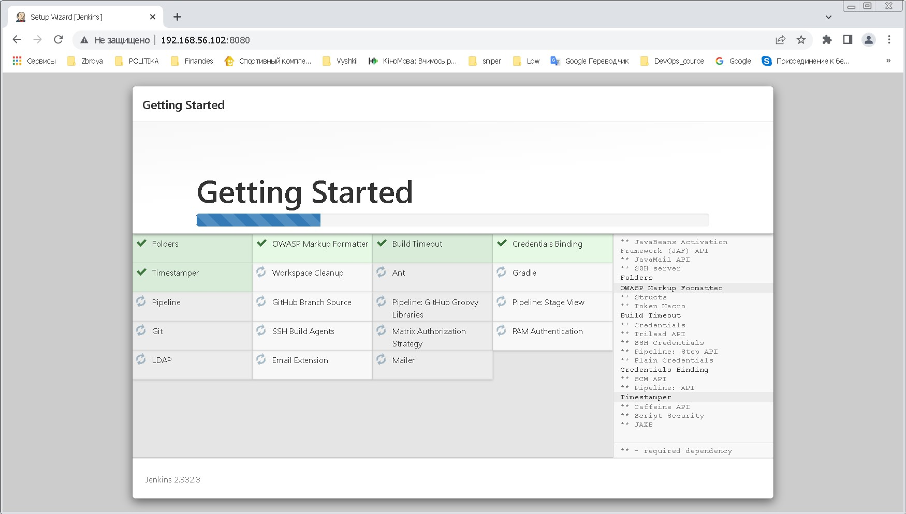
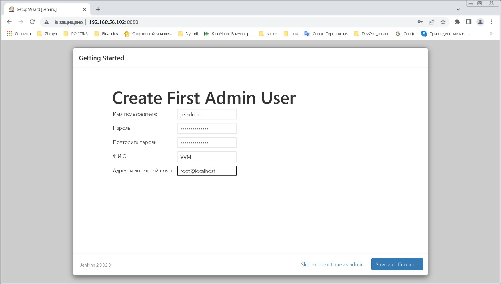
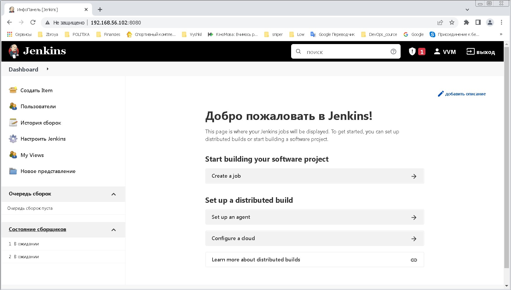
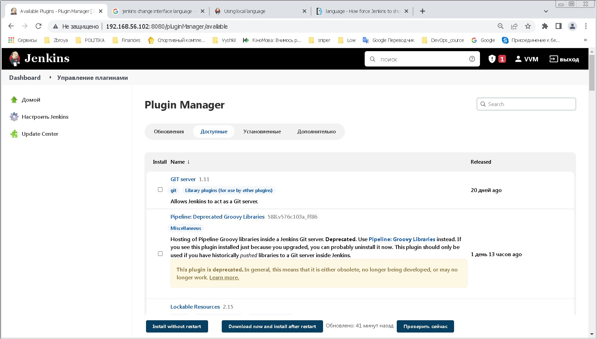

# ###################################
#  Module09 CI&CD Jenkins  Task 9.1
# ###################################

## ----------   Install Jenkins  -------------##
### --------------------------------------------
###  -- Install java (jdk) --
#### list available  java versions in repositaries 
---
```
  [root@ep-ol-vm02 vadim]# yum list | grep jdk
copy-jdk-configs.noarch                3.3-10.el7_5                ol7_latest
java-1.6.0-openjdk.x86_64              1:1.6.0.41-1.13.13.1.el7_3  ol7_latest
java-1.6.0-openjdk-devel.x86_64        1:1.6.0.41-1.13.13.1.el7_3  ol7_latest
java-1.7.0-openjdk.x86_64              1:1.7.0.261-2.6.22.2.0.1.el7_8
java-1.7.0-openjdk-devel.x86_64        1:1.7.0.261-2.6.22.2.0.1.el7_8
java-1.7.0-openjdk-headless.x86_64     1:1.7.0.261-2.6.22.2.0.1.el7_8
java-1.8.0-openjdk.i686                1:1.8.0.332.b09-1.el7_9     ol7_latest
java-1.8.0-openjdk.x86_64              1:1.8.0.332.b09-1.el7_9     ol7_latest
java-1.8.0-openjdk-accessibility.i686  1:1.8.0.191.b12-1.el7_6     ol7_latest
java-1.8.0-openjdk-accessibility-debug.i686
java-1.8.0-openjdk-demo.i686           1:1.8.0.275.b01-0.el7_9     ol7_latest
java-1.8.0-openjdk-demo-debug.i686     1:1.8.0.191.b12-1.el7_6     ol7_latest
java-1.8.0-openjdk-devel.i686          1:1.8.0.332.b09-1.el7_9     ol7_latest
java-1.8.0-openjdk-devel.x86_64        1:1.8.0.332.b09-1.el7_9     ol7_latest
java-1.8.0-openjdk-headless.i686       1:1.8.0.332.b09-1.el7_9     ol7_latest
java-1.8.0-openjdk-headless.x86_64     1:1.8.0.332.b09-1.el7_9     ol7_latest
java-1.8.0-openjdk-src.i686            1:1.8.0.275.b01-0.el7_9     ol7_latest
java-1.8.0-openjdk-src-debug.i686      1:1.8.0.191.b12-1.el7_6     ol7_latest
java-11-openjdk.i686                   1:11.0.15.0.9-2.0.1.el7_9   ol7_latest
java-11-openjdk.x86_64                 1:11.0.15.0.9-2.0.1.el7_9   ol7_latest   <-!!!
java-11-openjdk-debug.i686             1:11.0.5.10-0.0.1.el7_7     ol7_latest
java-11-openjdk-demo.i686              1:11.0.9.11-2.0.1.el7_9     ol7_latest
java-11-openjdk-demo-debug.i686        1:11.0.5.10-0.0.1.el7_7     ol7_latest
java-11-openjdk-devel.i686             1:11.0.15.0.9-2.0.1.el7_9   ol7_latest
java-11-openjdk-devel.x86_64           1:11.0.15.0.9-2.0.1.el7_9   ol7_latest
java-11-openjdk-devel-debug.i686       1:11.0.5.10-0.0.1.el7_7     ol7_latest
java-11-openjdk-headless.i686          1:11.0.15.0.9-2.0.1.el7_9   ol7_latest
java-11-openjdk-headless.x86_64        1:11.0.15.0.9-2.0.1.el7_9   ol7_latest
java-11-openjdk-headless-debug.i686    1:11.0.5.10-0.0.1.el7_7     ol7_latest
java-11-openjdk-javadoc.i686           1:11.0.9.11-2.0.1.el7_9     ol7_latest
java-11-openjdk-javadoc-debug.i686     1:11.0.5.10-0.0.1.el7_7     ol7_latest
java-11-openjdk-javadoc-zip.i686       1:11.0.9.11-2.0.1.el7_9     ol7_latest
java-11-openjdk-javadoc-zip-debug.i686 1:11.0.5.10-0.0.1.el7_7     ol7_latest
java-11-openjdk-jmods.i686             1:11.0.9.11-2.0.1.el7_9     ol7_latest
java-11-openjdk-jmods-debug.i686       1:11.0.5.10-0.0.1.el7_7     ol7_latest
java-11-openjdk-src.i686               1:11.0.9.11-2.0.1.el7_9     ol7_latest
java-11-openjdk-src-debug.i686         1:11.0.5.10-0.0.1.el7_7     ol7_latest
java-11-openjdk-static-libs.i686       1:11.0.15.0.9-2.0.1.el7_9   ol7_latest
java-11-openjdk-static-libs.x86_64     1:11.0.15.0.9-2.0.1.el7_9   ol7_latest
ldapjdk.noarch                         4.19-5.el7                  ol7_latest
[root@ep-ol-vm02 vadim]#

```
---
#### install openjdk-11 for Jenkins with dependencies yum install java-11-openjdk 
---
```
 [root@ep-ol-vm02 vadim]# yum install java-11-openjdk
Loaded plugins: langpacks, ulninfo
OL7_x86-64_MySQL80                                                                                                                    | 3.0 kB  00:00:00
ol7_UEKR6                                                                                                                             | 3.0 kB  00:00:00
ol7_latest                                                                                                                            | 3.6 kB  00:00:00
Resolving Dependencies
--> Running transaction check
---> Package java-11-openjdk.x86_64 1:11.0.15.0.9-2.0.1.el7_9 will be installed
--> Processing Dependency: java-11-openjdk-headless(x86-64) = 1:11.0.15.0.9-2.0.1.el7_9 for package: 1:java-11-openjdk-11.0.15.0.9-2.0.1.el7_9.x86_64
--> Processing Dependency: fontconfig(x86-64) for package: 1:java-11-openjdk-11.0.15.0.9-2.0.1.el7_9.x86_64
--> Processing Dependency: libjpeg.so.62(LIBJPEG_6.2)(64bit) for package: 1:java-11-openjdk-11.0.15.0.9-2.0.1.el7_9.x86_64
--> Processing Dependency: xorg-x11-fonts-Type1 for package: 1:java-11-openjdk-11.0.15.0.9-2.0.1.el7_9.x86_64
--> Processing Dependency: libX11.so.6()(64bit) for package: 1:java-11-openjdk-11.0.15.0.9-2.0.1.el7_9.x86_64
--> Processing Dependency: libXext.so.6()(64bit) for package: 1:java-11-openjdk-11.0.15.0.9-2.0.1.el7_9.x86_64
--> Processing Dependency: libXi.so.6()(64bit) for package: 1:java-11-openjdk-11.0.15.0.9-2.0.1.el7_9.x86_64
--> Processing Dependency: libXrender.so.1()(64bit) for package: 1:java-11-openjdk-11.0.15.0.9-2.0.1.el7_9.x86_64
--> Processing Dependency: libXtst.so.6()(64bit) for package: 1:java-11-openjdk-11.0.15.0.9-2.0.1.el7_9.x86_64
--> Processing Dependency: libgif.so.4()(64bit) for package: 1:java-11-openjdk-11.0.15.0.9-2.0.1.el7_9.x86_64
--> Processing Dependency: libjava.so()(64bit) for package: 1:java-11-openjdk-11.0.15.0.9-2.0.1.el7_9.x86_64
--> Processing Dependency: libjpeg.so.62()(64bit) for package: 1:java-11-openjdk-11.0.15.0.9-2.0.1.el7_9.x86_64
--> Processing Dependency: libjvm.so()(64bit) for package: 1:java-11-openjdk-11.0.15.0.9-2.0.1.el7_9.x86_64
--> Running transaction check
---> Package fontconfig.x86_64 0:2.13.0-4.3.el7 will be installed
--> Processing Dependency: dejavu-sans-fonts for package: fontconfig-2.13.0-4.3.el7.x86_64
--> Processing Dependency: fontpackages-filesystem for package: fontconfig-2.13.0-4.3.el7.x86_64
---> Package giflib.x86_64 0:4.1.6-9.el7 will be installed
--> Processing Dependency: libICE.so.6()(64bit) for package: giflib-4.1.6-9.el7.x86_64
--> Processing Dependency: libSM.so.6()(64bit) for package: giflib-4.1.6-9.el7.x86_64
---> Package java-11-openjdk-headless.x86_64 1:11.0.15.0.9-2.0.1.el7_9 will be installed
--> Processing Dependency: copy-jdk-configs >= 3.3 for package: 1:java-11-openjdk-headless-11.0.15.0.9-2.0.1.el7_9.x86_64
--> Processing Dependency: tzdata-java >= 2020f for package: 1:java-11-openjdk-headless-11.0.15.0.9-2.0.1.el7_9.x86_64
--> Processing Dependency: cups-libs(x86-64) for package: 1:java-11-openjdk-headless-11.0.15.0.9-2.0.1.el7_9.x86_64
--> Processing Dependency: javapackages-tools for package: 1:java-11-openjdk-headless-11.0.15.0.9-2.0.1.el7_9.x86_64
--> Processing Dependency: lksctp-tools(x86-64) for package: 1:java-11-openjdk-headless-11.0.15.0.9-2.0.1.el7_9.x86_64
--> Processing Dependency: pcsc-lite-libs(x86-64) for package: 1:java-11-openjdk-headless-11.0.15.0.9-2.0.1.el7_9.x86_64
---> Package libX11.x86_64 0:1.6.7-4.el7_9 will be installed
--> Processing Dependency: libX11-common >= 1.6.7-4.el7_9 for package: libX11-1.6.7-4.el7_9.x86_64
--> Processing Dependency: libxcb.so.1()(64bit) for package: libX11-1.6.7-4.el7_9.x86_64
---> Package libXext.x86_64 0:1.3.3-3.el7 will be installed
---> Package libXi.x86_64 0:1.7.9-1.el7 will be installed
---> Package libXrender.x86_64 0:0.9.10-1.el7 will be installed
---> Package libXtst.x86_64 0:1.2.3-1.el7 will be installed
---> Package libjpeg-turbo.x86_64 0:1.2.90-8.el7 will be installed
---> Package xorg-x11-fonts-Type1.noarch 0:7.5-9.el7 will be installed
--> Processing Dependency: mkfontdir for package: xorg-x11-fonts-Type1-7.5-9.el7.noarch
--> Processing Dependency: mkfontdir for package: xorg-x11-fonts-Type1-7.5-9.el7.noarch
--> Processing Dependency: ttmkfdir for package: xorg-x11-fonts-Type1-7.5-9.el7.noarch
--> Processing Dependency: ttmkfdir for package: xorg-x11-fonts-Type1-7.5-9.el7.noarch
--> Running transaction check
---> Package copy-jdk-configs.noarch 0:3.3-10.el7_5 will be installed
---> Package cups-libs.x86_64 1:1.6.3-51.el7 will be installed
--> Processing Dependency: libavahi-client.so.3()(64bit) for package: 1:cups-libs-1.6.3-51.el7.x86_64
--> Processing Dependency: libavahi-common.so.3()(64bit) for package: 1:cups-libs-1.6.3-51.el7.x86_64
---> Package dejavu-sans-fonts.noarch 0:2.33-6.el7 will be installed
--> Processing Dependency: dejavu-fonts-common = 2.33-6.el7 for package: dejavu-sans-fonts-2.33-6.el7.noarch
---> Package fontpackages-filesystem.noarch 0:1.44-8.el7 will be installed
---> Package javapackages-tools.noarch 0:3.4.1-11.el7 will be installed
--> Processing Dependency: python-javapackages = 3.4.1-11.el7 for package: javapackages-tools-3.4.1-11.el7.noarch
--> Processing Dependency: libxslt for package: javapackages-tools-3.4.1-11.el7.noarch
---> Package libICE.x86_64 0:1.0.9-9.el7 will be installed
---> Package libSM.x86_64 0:1.2.2-2.el7 will be installed
---> Package libX11-common.noarch 0:1.6.7-4.el7_9 will be installed
---> Package libxcb.x86_64 0:1.13-1.el7 will be installed
--> Processing Dependency: libXau.so.6()(64bit) for package: libxcb-1.13-1.el7.x86_64
---> Package lksctp-tools.x86_64 0:1.0.17-2.el7 will be installed
---> Package pcsc-lite-libs.x86_64 0:1.8.8-8.el7 will be installed
---> Package ttmkfdir.x86_64 0:3.0.9-42.el7 will be installed
---> Package tzdata-java.noarch 0:2022a-1.el7 will be installed
---> Package xorg-x11-font-utils.x86_64 1:7.5-21.el7 will be installed
--> Processing Dependency: libfontenc.so.1()(64bit) for package: 1:xorg-x11-font-utils-7.5-21.el7.x86_64
--> Running transaction check
---> Package avahi-libs.x86_64 0:0.6.31-20.el7 will be installed
---> Package dejavu-fonts-common.noarch 0:2.33-6.el7 will be installed
---> Package libXau.x86_64 0:1.0.8-2.1.el7 will be installed
---> Package libfontenc.x86_64 0:1.1.3-3.el7 will be installed
---> Package libxslt.x86_64 0:1.1.28-6.0.1.el7 will be installed
---> Package python-javapackages.noarch 0:3.4.1-11.el7 will be installed
--> Processing Dependency: python-lxml for package: python-javapackages-3.4.1-11.el7.noarch
--> Running transaction check
---> Package python-lxml.x86_64 0:3.2.1-4.el7 will be installed
--> Finished Dependency Resolution

Dependencies Resolved

=============================================================================================================================================================
 Package                                      Arch                       Version                                        Repository                      Size
=============================================================================================================================================================
Installing:
 java-11-openjdk                              x86_64                     1:11.0.15.0.9-2.0.1.el7_9                      ol7_latest                     235 k
Installing for dependencies:
 avahi-libs                                   x86_64                     0.6.31-20.el7                                  ol7_latest                      61 k
 copy-jdk-configs                             noarch                     3.3-10.el7_5                                   ol7_latest                      21 k
 cups-libs                                    x86_64                     1:1.6.3-51.el7                                 ol7_latest                     359 k
 dejavu-fonts-common                          noarch                     2.33-6.el7                                     ol7_latest                      64 k
 dejavu-sans-fonts                            noarch                     2.33-6.el7                                     ol7_latest                     1.4 M
 fontconfig                                   x86_64                     2.13.0-4.3.el7                                 ol7_latest                     254 k
 fontpackages-filesystem                      noarch                     1.44-8.el7                                     ol7_latest                     9.4 k
 giflib                                       x86_64                     4.1.6-9.el7                                    ol7_latest                      39 k
 java-11-openjdk-headless                     x86_64                     1:11.0.15.0.9-2.0.1.el7_9                      ol7_latest                      39 M
 javapackages-tools                           noarch                     3.4.1-11.el7                                   ol7_latest                      72 k
 libICE                                       x86_64                     1.0.9-9.el7                                    ol7_latest                      66 k
 libSM                                        x86_64                     1.2.2-2.el7                                    ol7_latest                      39 k
 libX11                                       x86_64                     1.6.7-4.el7_9                                  ol7_latest                     607 k
 libX11-common                                noarch                     1.6.7-4.el7_9                                  ol7_latest                     164 k
 libXau                                       x86_64                     1.0.8-2.1.el7                                  ol7_latest                      28 k
 libXext                                      x86_64                     1.3.3-3.el7                                    ol7_latest                      38 k
 libXi                                        x86_64                     1.7.9-1.el7                                    ol7_latest                      40 k
 libXrender                                   x86_64                     0.9.10-1.el7                                   ol7_latest                      25 k
 libXtst                                      x86_64                     1.2.3-1.el7                                    ol7_latest                      20 k
 libfontenc                                   x86_64                     1.1.3-3.el7                                    ol7_latest                      30 k
 libjpeg-turbo                                x86_64                     1.2.90-8.el7                                   ol7_latest                     134 k
 libxcb                                       x86_64                     1.13-1.el7                                     ol7_latest                     213 k
 libxslt                                      x86_64                     1.1.28-6.0.1.el7                               ol7_latest                     241 k
 lksctp-tools                                 x86_64                     1.0.17-2.el7                                   ol7_latest                      87 k
 pcsc-lite-libs                               x86_64                     1.8.8-8.el7                                    ol7_latest                      34 k
 python-javapackages                          noarch                     3.4.1-11.el7                                   ol7_latest                      31 k
 python-lxml                                  x86_64                     3.2.1-4.el7                                    ol7_latest                     758 k
 ttmkfdir                                     x86_64                     3.0.9-42.el7                                   ol7_latest                      47 k
 tzdata-java                                  noarch                     2022a-1.el7                                    ol7_latest                     190 k
 xorg-x11-font-utils                          x86_64                     1:7.5-21.el7                                   ol7_latest                     104 k
 xorg-x11-fonts-Type1                         noarch                     7.5-9.el7                                      ol7_latest                     521 k

Transaction Summary
=============================================================================================================================================================
Install  1 Package (+31 Dependent packages)

Total download size: 45 M
Installed size: 182 M
Is this ok [y/d/N]: y
Downloading packages:
(1/32): copy-jdk-configs-3.3-10.el7_5.noarch.rpm                                                                                      |  21 kB  00:00:00
(2/32): avahi-libs-0.6.31-20.el7.x86_64.rpm                                                                                           |  61 kB  00:00:00
(3/32): cups-libs-1.6.3-51.el7.x86_64.rpm                                                                                             | 359 kB  00:00:00
(4/32): dejavu-fonts-common-2.33-6.el7.noarch.rpm                                                                                     |  64 kB  00:00:00
(5/32): fontconfig-2.13.0-4.3.el7.x86_64.rpm                                                                                          | 254 kB  00:00:00
(6/32): fontpackages-filesystem-1.44-8.el7.noarch.rpm                                                                                 | 9.4 kB  00:00:00
(7/32): giflib-4.1.6-9.el7.x86_64.rpm                                                                                                 |  39 kB  00:00:00
(8/32): java-11-openjdk-11.0.15.0.9-2.0.1.el7_9.x86_64.rpm                                                                            | 235 kB  00:00:00
(9/32): dejavu-sans-fonts-2.33-6.el7.noarch.rpm                                                                                       | 1.4 MB  00:00:00
(10/32): javapackages-tools-3.4.1-11.el7.noarch.rpm                                                                                   |  72 kB  00:00:00
(11/32): libICE-1.0.9-9.el7.x86_64.rpm                                                                                                |  66 kB  00:00:00
(12/32): libSM-1.2.2-2.el7.x86_64.rpm                                                                                                 |  39 kB  00:00:00
(13/32): libX11-1.6.7-4.el7_9.x86_64.rpm                                                                                              | 607 kB  00:00:00
(14/32): libX11-common-1.6.7-4.el7_9.noarch.rpm                                                                                       | 164 kB  00:00:00
(15/32): libXau-1.0.8-2.1.el7.x86_64.rpm                                                                                              |  28 kB  00:00:00
(16/32): libXext-1.3.3-3.el7.x86_64.rpm                                                                                               |  38 kB  00:00:00
(17/32): libXi-1.7.9-1.el7.x86_64.rpm                                                                                                 |  40 kB  00:00:00
(18/32): libXrender-0.9.10-1.el7.x86_64.rpm                                                                                           |  25 kB  00:00:00
(19/32): libXtst-1.2.3-1.el7.x86_64.rpm                                                                                               |  20 kB  00:00:00
(20/32): libfontenc-1.1.3-3.el7.x86_64.rpm                                                                                            |  30 kB  00:00:00
(21/32): libjpeg-turbo-1.2.90-8.el7.x86_64.rpm                                                                                        | 134 kB  00:00:00
(22/32): libxcb-1.13-1.el7.x86_64.rpm                                                                                                 | 213 kB  00:00:00
(23/32): libxslt-1.1.28-6.0.1.el7.x86_64.rpm                                                                                          | 241 kB  00:00:00
(24/32): lksctp-tools-1.0.17-2.el7.x86_64.rpm                                                                                         |  87 kB  00:00:00
(25/32): pcsc-lite-libs-1.8.8-8.el7.x86_64.rpm                                                                                        |  34 kB  00:00:00
(26/32): python-javapackages-3.4.1-11.el7.noarch.rpm                                                                                  |  31 kB  00:00:00
(27/32): python-lxml-3.2.1-4.el7.x86_64.rpm                                                                                           | 758 kB  00:00:00
(28/32): ttmkfdir-3.0.9-42.el7.x86_64.rpm                                                                                             |  47 kB  00:00:00
(29/32): tzdata-java-2022a-1.el7.noarch.rpm                                                                                           | 190 kB  00:00:00
(30/32): xorg-x11-font-utils-7.5-21.el7.x86_64.rpm                                                                                    | 104 kB  00:00:00
(31/32): xorg-x11-fonts-Type1-7.5-9.el7.noarch.rpm                                                                                    | 521 kB  00:00:00
(32/32): java-11-openjdk-headless-11.0.15.0.9-2.0.1.el7_9.x86_64.rpm                                                                  |  39 MB  00:00:06
-------------------------------------------------------------------------------------------------------------------------------------------------------------
Total                                                                                                                        6.1 MB/s |  45 MB  00:00:07
Running transaction check
Running transaction test
Transaction test succeeded
Running transaction
  Installing : libjpeg-turbo-1.2.90-8.el7.x86_64                                                                                                        1/32
  Installing : fontpackages-filesystem-1.44-8.el7.noarch                                                                                                2/32
  Installing : libICE-1.0.9-9.el7.x86_64                                                                                                                3/32
  Installing : libxslt-1.1.28-6.0.1.el7.x86_64                                                                                                          4/32
  Installing : python-lxml-3.2.1-4.el7.x86_64                                                                                                           5/32
  Installing : python-javapackages-3.4.1-11.el7.noarch                                                                                                  6/32
  Installing : javapackages-tools-3.4.1-11.el7.noarch                                                                                                   7/32
  Installing : libSM-1.2.2-2.el7.x86_64                                                                                                                 8/32
  Installing : dejavu-fonts-common-2.33-6.el7.noarch                                                                                                    9/32
  Installing : dejavu-sans-fonts-2.33-6.el7.noarch                                                                                                     10/32
  Installing : fontconfig-2.13.0-4.3.el7.x86_64                                                                                                        11/32
  Installing : avahi-libs-0.6.31-20.el7.x86_64                                                                                                         12/32
  Installing : 1:cups-libs-1.6.3-51.el7.x86_64                                                                                                         13/32
  Installing : libX11-common-1.6.7-4.el7_9.noarch                                                                                                      14/32
  Installing : libfontenc-1.1.3-3.el7.x86_64                                                                                                           15/32
  Installing : 1:xorg-x11-font-utils-7.5-21.el7.x86_64                                                                                                 16/32
  Installing : libXau-1.0.8-2.1.el7.x86_64                                                                                                             17/32
  Installing : libxcb-1.13-1.el7.x86_64                                                                                                                18/32
  Installing : libX11-1.6.7-4.el7_9.x86_64                                                                                                             19/32
  Installing : libXext-1.3.3-3.el7.x86_64                                                                                                              20/32
  Installing : libXi-1.7.9-1.el7.x86_64                                                                                                                21/32
  Installing : libXtst-1.2.3-1.el7.x86_64                                                                                                              22/32
  Installing : giflib-4.1.6-9.el7.x86_64                                                                                                               23/32
  Installing : libXrender-0.9.10-1.el7.x86_64                                                                                                          24/32
  Installing : tzdata-java-2022a-1.el7.noarch                                                                                                          25/32
  Installing : pcsc-lite-libs-1.8.8-8.el7.x86_64                                                                                                       26/32
  Installing : lksctp-tools-1.0.17-2.el7.x86_64                                                                                                        27/32
  Installing : copy-jdk-configs-3.3-10.el7_5.noarch                                                                                                    28/32
  Installing : 1:java-11-openjdk-headless-11.0.15.0.9-2.0.1.el7_9.x86_64                                                                               29/32
  Installing : ttmkfdir-3.0.9-42.el7.x86_64                                                                                                            30/32
  Installing : xorg-x11-fonts-Type1-7.5-9.el7.noarch                                                                                                   31/32
  Installing : 1:java-11-openjdk-11.0.15.0.9-2.0.1.el7_9.x86_64                                                                                        32/32
  Verifying  : libXext-1.3.3-3.el7.x86_64                                                                                                               1/32
  Verifying  : libXi-1.7.9-1.el7.x86_64                                                                                                                 2/32
  Verifying  : fontconfig-2.13.0-4.3.el7.x86_64                                                                                                         3/32
  Verifying  : giflib-4.1.6-9.el7.x86_64                                                                                                                4/32
  Verifying  : libXrender-0.9.10-1.el7.x86_64                                                                                                           5/32
  Verifying  : 1:xorg-x11-font-utils-7.5-21.el7.x86_64                                                                                                  6/32
  Verifying  : libxslt-1.1.28-6.0.1.el7.x86_64                                                                                                          7/32
  Verifying  : libICE-1.0.9-9.el7.x86_64                                                                                                                8/32
  Verifying  : 1:cups-libs-1.6.3-51.el7.x86_64                                                                                                          9/32
  Verifying  : fontpackages-filesystem-1.44-8.el7.noarch                                                                                               10/32
  Verifying  : ttmkfdir-3.0.9-42.el7.x86_64                                                                                                            11/32
  Verifying  : 1:java-11-openjdk-11.0.15.0.9-2.0.1.el7_9.x86_64                                                                                        12/32
  Verifying  : copy-jdk-configs-3.3-10.el7_5.noarch                                                                                                    13/32
  Verifying  : python-javapackages-3.4.1-11.el7.noarch                                                                                                 14/32
  Verifying  : dejavu-fonts-common-2.33-6.el7.noarch                                                                                                   15/32
  Verifying  : libXtst-1.2.3-1.el7.x86_64                                                                                                              16/32
  Verifying  : libxcb-1.13-1.el7.x86_64                                                                                                                17/32
  Verifying  : lksctp-tools-1.0.17-2.el7.x86_64                                                                                                        18/32
  Verifying  : libjpeg-turbo-1.2.90-8.el7.x86_64                                                                                                       19/32
  Verifying  : xorg-x11-fonts-Type1-7.5-9.el7.noarch                                                                                                   20/32
  Verifying  : dejavu-sans-fonts-2.33-6.el7.noarch                                                                                                     21/32
  Verifying  : pcsc-lite-libs-1.8.8-8.el7.x86_64                                                                                                       22/32
  Verifying  : javapackages-tools-3.4.1-11.el7.noarch                                                                                                  23/32
  Verifying  : tzdata-java-2022a-1.el7.noarch                                                                                                          24/32
  Verifying  : libXau-1.0.8-2.1.el7.x86_64                                                                                                             25/32
  Verifying  : libSM-1.2.2-2.el7.x86_64                                                                                                                26/32
  Verifying  : libX11-1.6.7-4.el7_9.x86_64                                                                                                             27/32
  Verifying  : python-lxml-3.2.1-4.el7.x86_64                                                                                                          28/32
  Verifying  : 1:java-11-openjdk-headless-11.0.15.0.9-2.0.1.el7_9.x86_64                                                                               29/32
  Verifying  : libfontenc-1.1.3-3.el7.x86_64                                                                                                           30/32
  Verifying  : libX11-common-1.6.7-4.el7_9.noarch                                                                                                      31/32
  Verifying  : avahi-libs-0.6.31-20.el7.x86_64                                                                                                         32/32

Installed:
  java-11-openjdk.x86_64 1:11.0.15.0.9-2.0.1.el7_9

Dependency Installed:
  avahi-libs.x86_64 0:0.6.31-20.el7               copy-jdk-configs.noarch 0:3.3-10.el7_5        cups-libs.x86_64 1:1.6.3-51.el7
  dejavu-fonts-common.noarch 0:2.33-6.el7         dejavu-sans-fonts.noarch 0:2.33-6.el7         fontconfig.x86_64 0:2.13.0-4.3.el7
  fontpackages-filesystem.noarch 0:1.44-8.el7     giflib.x86_64 0:4.1.6-9.el7                   java-11-openjdk-headless.x86_64 1:11.0.15.0.9-2.0.1.el7_9
  javapackages-tools.noarch 0:3.4.1-11.el7        libICE.x86_64 0:1.0.9-9.el7                   libSM.x86_64 0:1.2.2-2.el7
  libX11.x86_64 0:1.6.7-4.el7_9                   libX11-common.noarch 0:1.6.7-4.el7_9          libXau.x86_64 0:1.0.8-2.1.el7
  libXext.x86_64 0:1.3.3-3.el7                    libXi.x86_64 0:1.7.9-1.el7                    libXrender.x86_64 0:0.9.10-1.el7
  libXtst.x86_64 0:1.2.3-1.el7                    libfontenc.x86_64 0:1.1.3-3.el7               libjpeg-turbo.x86_64 0:1.2.90-8.el7
  libxcb.x86_64 0:1.13-1.el7                      libxslt.x86_64 0:1.1.28-6.0.1.el7             lksctp-tools.x86_64 0:1.0.17-2.el7
  pcsc-lite-libs.x86_64 0:1.8.8-8.el7             python-javapackages.noarch 0:3.4.1-11.el7     python-lxml.x86_64 0:3.2.1-4.el7
  ttmkfdir.x86_64 0:3.0.9-42.el7                  tzdata-java.noarch 0:2022a-1.el7              xorg-x11-font-utils.x86_64 1:7.5-21.el7
  xorg-x11-fonts-Type1.noarch 0:7.5-9.el7

Complete!
[root@ep-ol-vm02 vadim]#

```
---
#### --- check installed java packages 
```
 [root@ep-ol-vm02 vadim]# yum list installed | egrep 'java|jdk'
copy-jdk-configs.noarch               3.3-10.el7_5                 @ol7_latest
java-11-openjdk.x86_64                1:11.0.15.0.9-2.0.1.el7_9    @ol7_latest   <- !!!
java-11-openjdk-headless.x86_64       1:11.0.15.0.9-2.0.1.el7_9    @ol7_latest
javapackages-tools.noarch             3.4.1-11.el7                 @ol7_latest
python-javapackages.noarch            3.4.1-11.el7                 @ol7_latest
tzdata-java.noarch                    2022a-1.el7                  @ol7_latest
[root@ep-ol-vm02 vadim]#

```

#### --- Install Jenkins  and run Jenkins ----
---
#### Go to  https://pkg.jenkins.io/redhat-stable/jenkins.repo. Create /etc/yum.repos.d/jenkins.repo. Check added repositories and jenkins packages
---

```
[root@ep-ol-vm02 yum.repos.d]# cat /etc/yum.repos.d/jenkins.repo
[jenkins]
name=Jenkins-stable
baseurl=http://pkg.jenkins.io/redhat-stable
gpgcheck=1

[root@ep-ol-vm02 yum.repos.d]# yum repolist
Loaded plugins: langpacks, ulninfo
jenkins                                                                                                                               | 2.9 kB  00:00:00
jenkins/primary_db                                                                                                                    |  41 kB  00:00:00
repo id                                         repo name                                                                                              status
OL7_x86-64_MySQL80/x86_64                       MySQL 8.0 for Oracle Linux 7Server  (x86_64)                                                              320
jenkins                                         Jenkins-stable                                                                                            132
ol7_UEKR6/x86_64                                Latest Unbreakable Enterprise Kernel Release 6 for Oracle Linux 7Server (x86_64)                          680
ol7_latest/x86_64                               Oracle Linux 7Server Latest (x86_64)                                                                   24,340
repolist: 25,472
[root@ep-ol-vm02 yum.repos.d]#

[root@ep-ol-vm02 yum.repos.d]# yum list jenkins
Loaded plugins: langpacks, ulninfo
Available Packages
jenkins.noarch                                                              2.332.3-1.1                                                               jenkins
[root@ep-ol-vm02 yum.repos.d]#
```

####  install jenkins package 

```
[root@ep-ol-vm02 yum.repos.d]# yum install jenkins
Loaded plugins: langpacks, ulninfo
Resolving Dependencies
--> Running transaction check
---> Package jenkins.noarch 0:2.332.3-1.1 will be installed
--> Finished Dependency Resolution

Dependencies Resolved

=================================================================================================================================================
 Package                      Arch                             Version                                  Repository                           Size
=================================================================================================================================================
Installing:
 jenkins                       noarch                           2.332.3-1.1                          jenkins                              90 M

Transaction Summary
=================================================================================================================================================
Install  1 Package

Total download size: 90 M
Installed size: 91 M
Is this ok [y/d/N]: y
Downloading packages:
jenkins-2.332.3-1.1.noarch.rpm                                                                                              |  90 MB  00:00:54
Running transaction check
Running transaction test
Transaction test succeeded
Running transaction
  Installing : jenkins-2.332.3-1.1.noarch                                                                                              1/1
  Verifying  : jenkins-2.332.3-1.1.noarch                                                                                              1/1

Installed:
  jenkins.noarch 0:2.332.3-1.1

Complete!
[root@ep-ol-vm02 yum.repos.d]#
[root@ep-ol-vm02 yum.repos.d]# yum list installed jenkins
Loaded plugins: langpacks, ulninfo
Installed Packages
jenkins.noarch                                                 2.332.3-1.1                                                              @jenkins
[root@ep-ol-vm02 yum.repos.d]#
[root@ep-ol-vm02 yum.repos.d]#

```

####  configuration and start jenkins service
```
[root@ep-ol-vm02 jenkins]# vi /etc/default/jenkins
HTTP_PORT="8080"    #--port 8080 use Jenkins  by default 

[root@ep-ol-vm02 jenkins]#

[root@ep-ol-vm02 yum.repos.d]# systemctl list-unit-files | grep jenkin
jenkins.service                               disabled
[root@ep-ol-vm02 yum.repos.d]#
[root@ep-ol-vm02 yum.repos.d]# systemctl start jenkins.service      <- !!!

[root@ep-ol-vm02 yum.repos.d]# systemctl status jenkins.service     <-!!!
● jenkins.service - Jenkins Continuous Integration Server
   Loaded: loaded (/usr/lib/systemd/system/jenkins.service; disabled; vendor preset: disabled)
   Active: active (running) since Mon 2022-05-23 18:53:27 EEST; 1min 2s ago
 Main PID: 2660 (java)
   CGroup: /system.slice/jenkins.service
           └─2660 /usr/bin/java -Djava.awt.headless=true -jar /usr/share/java/jenkins.war --webroot=%C/jenkins/war --httpPort=8080

May 23 18:52:53 ep-ol-vm02 jenkins[2660]: This may also be found at: /var/lib/jenkins/secrets/initialAdminPassword
May 23 18:52:53 ep-ol-vm02 jenkins[2660]: *************************************************************
May 23 18:52:53 ep-ol-vm02 jenkins[2660]: *************************************************************
May 23 18:52:53 ep-ol-vm02 jenkins[2660]: *************************************************************
May 23 18:53:27 ep-ol-vm02 jenkins[2660]: 2022-05-23 15:53:27.497+0000 [id=28]        INFO        jenkins.InitReactorRunner$1#onAttained: Complet...alization
May 23 18:53:27 ep-ol-vm02 jenkins[2660]: 2022-05-23 15:53:27.603+0000 [id=22]        INFO        hudson.lifecycle.Lifecycle#onReady: Jenkins is ...d running
May 23 18:53:27 ep-ol-vm02 systemd[1]: Started Jenkins Continuous Integration Server.
May 23 18:53:28 ep-ol-vm02 jenkins[2660]: 2022-05-23 15:53:28.202+0000 [id=43]        INFO        h.m.DownloadService$Downloadable#load: Obtained...Installer
May 23 18:53:28 ep-ol-vm02 jenkins[2660]: 2022-05-23 15:53:28.203+0000 [id=43]        INFO        hudson.util.Retrier#start: Performed the action...ttempt #1
May 23 18:53:28 ep-ol-vm02 jenkins[2660]: 2022-05-23 15:53:28.205+0000 [id=43]        INFO        hudson.model.AsyncPeriodicWork#lambda$doRun$1: ...36,235 ms
Hint: Some lines were ellipsized, use -l to show in full.
[root@ep-ol-vm02 yum.repos.d]#


[root@ep-ol-vm02 yum.repos.d]# ps -ef| grep  jenk
jenkins   2660     1 17 18:52 ?        00:00:39 /usr/bin/java -Djava.awt.headless=true -jar /usr/share/java/jenkins.war --webroot=%C/jenkins/war --httpPort=8080
root      2817  1938  0 18:56 pts/0    00:00:00 grep --color=auto jenk
[root@ep-ol-vm02 yum.repos.d]#
[root@ep-ol-vm02 yum.repos.d]#
[root@ep-ol-vm02 yum.repos.d]# netstat -lnp | grep 8080
tcp6       0      0 :::8080                 :::*                    LISTEN      2660/java
[root@ep-ol-vm02 yum.repos.d]#

```

#### In Browser http://192.168.56.102:8080/


#### cat file with temporary PWD and insert it to field t
```
[root@ep-ol-vm02 vadim]# cat /var/lib/jenkins/secrets/initialAdminPassword
3ec3.....81c07
[root@ep-ol-vm02 vadim]#
```

####  --- install suggested plugins 


----------------------------------------------------------------


####   - Create admin user 


#### -- first Jenkins Welcome   page 



## --- Change Languge ( Localization ) in Jenkins ---
#### (1) Install plugin. Manage Jenkins -> Manage Plugin -> Available Plugin
#### Find plugin “Localization SupportVersion1.1”. Select this plugin  press “Download and install after restart

####  After install plugin  change Language in Google chrome


#### Restart browser. And go Jenkins Dashboard  http://192.168.56.102:8080/


